## Considérez-vous vos conditions de travail

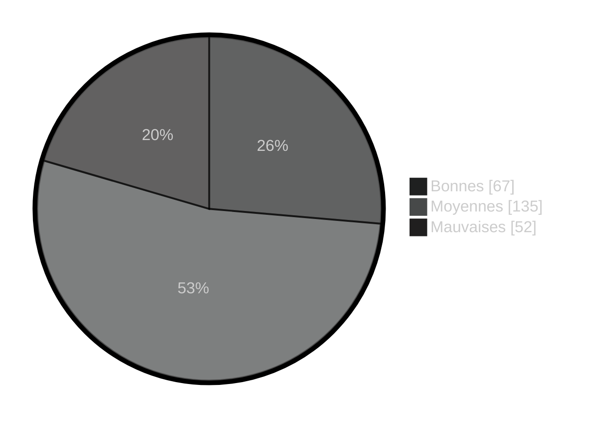
***
## Depuis 2020, considérez-vous que vos conditions de travail 

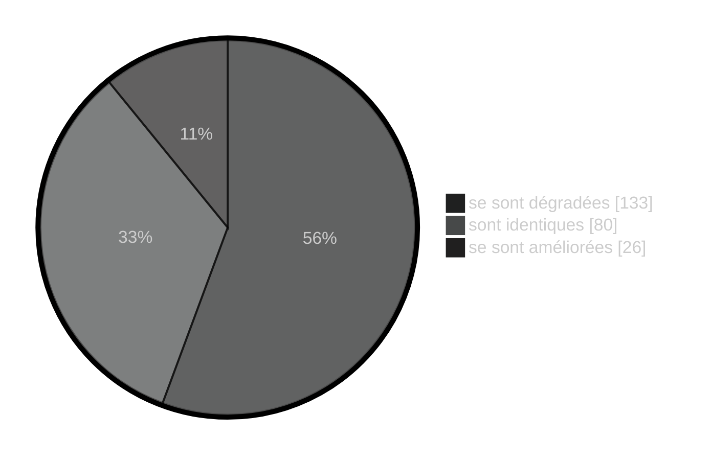

***

### Estimez-vous que votre responsable hiérarchique assume ses responsabilités
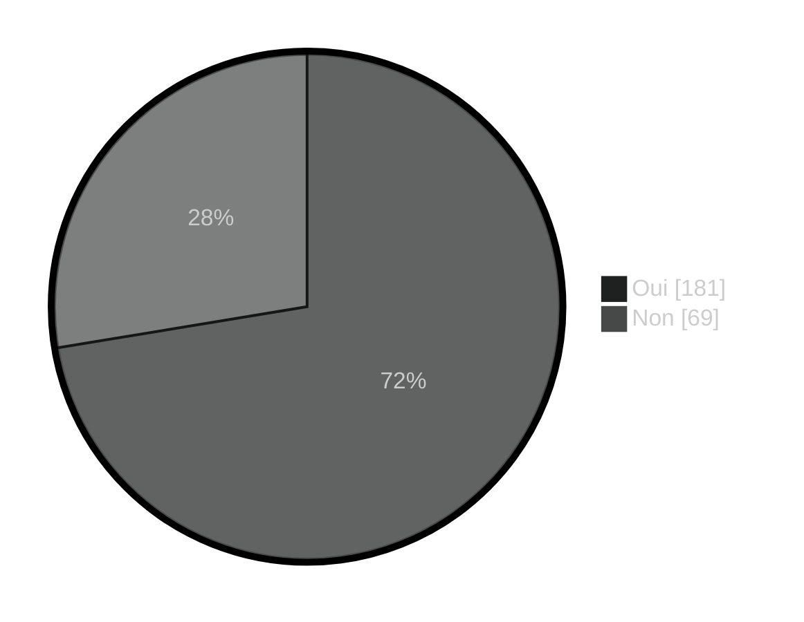
***
## Estimez-vous que votre hiérarchie (autre que votre responsable hiérarchique direct) assume ses responsabilités

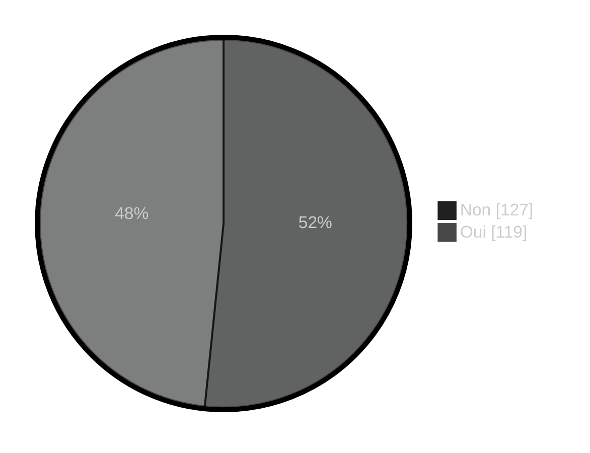

***
## Est-ce qu'il s'agit de

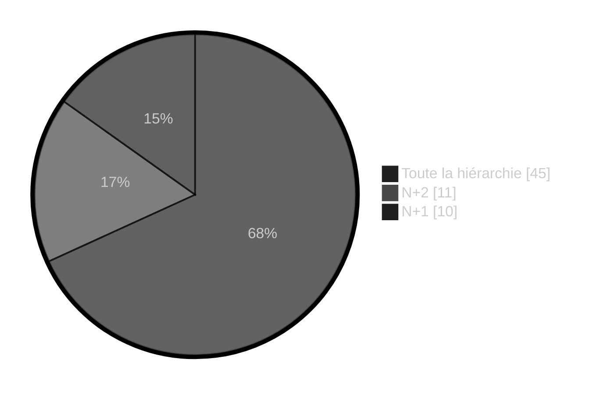
***
## Êtes-vous en conflit ou en désaccord avec votre supérieur hiérarchique direct

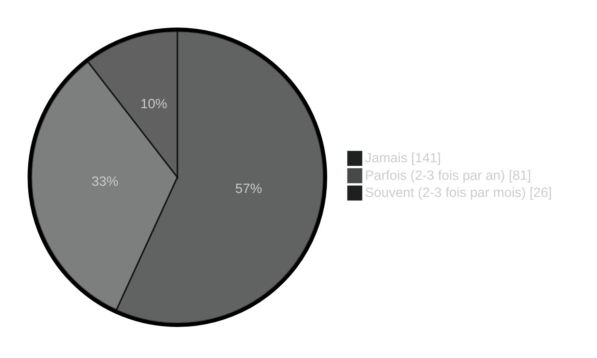
***
## Êtes-vous en conflit avec vos responsables hiérarchiques (autre que le responsable hiérarchique direct)
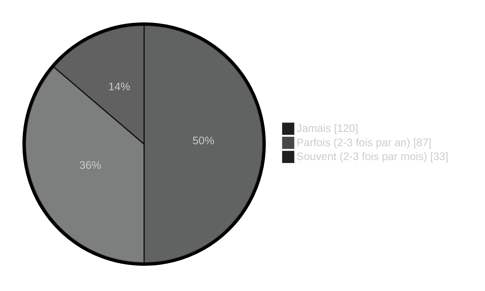
***
## Êtes-vous en conflit avec vos collaborateurs
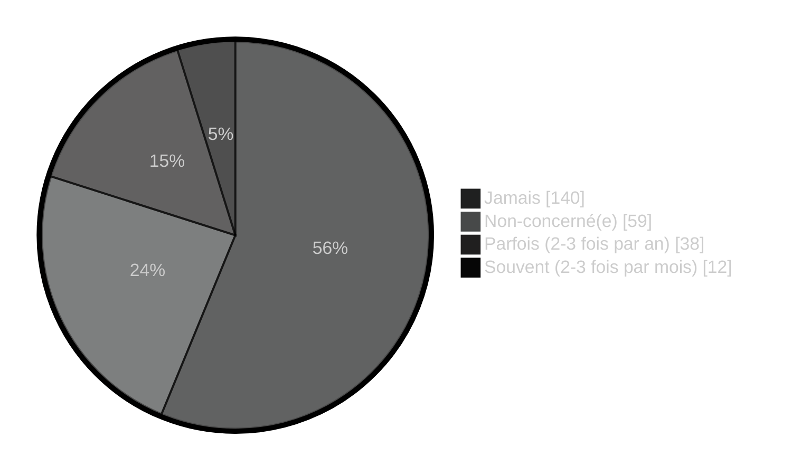
***
## Êtes-vous en conflit avec vos collègues
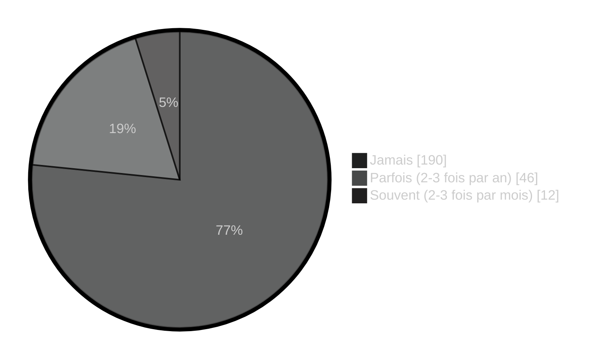
***
## Exercez-vous une partie de votre activité en télétravail ?
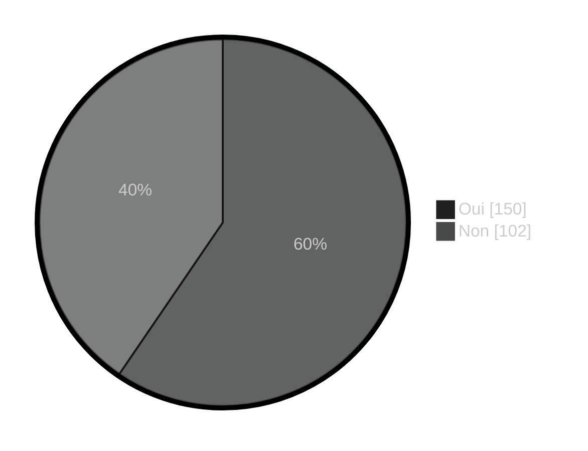
***
## Si non, vous n'avez pas de télétravail car
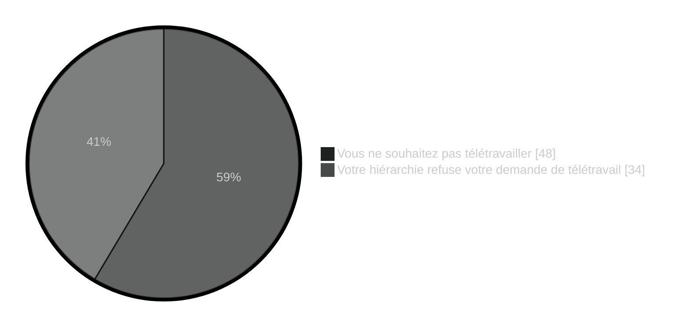
***
## En moyenne, combien de jours télétravaillez-vous par semaine ?
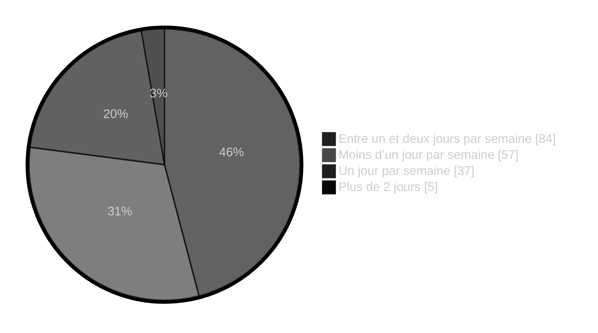
***
## Est-ce que l'on vous a imposé le nombre de jours en télétravail ?
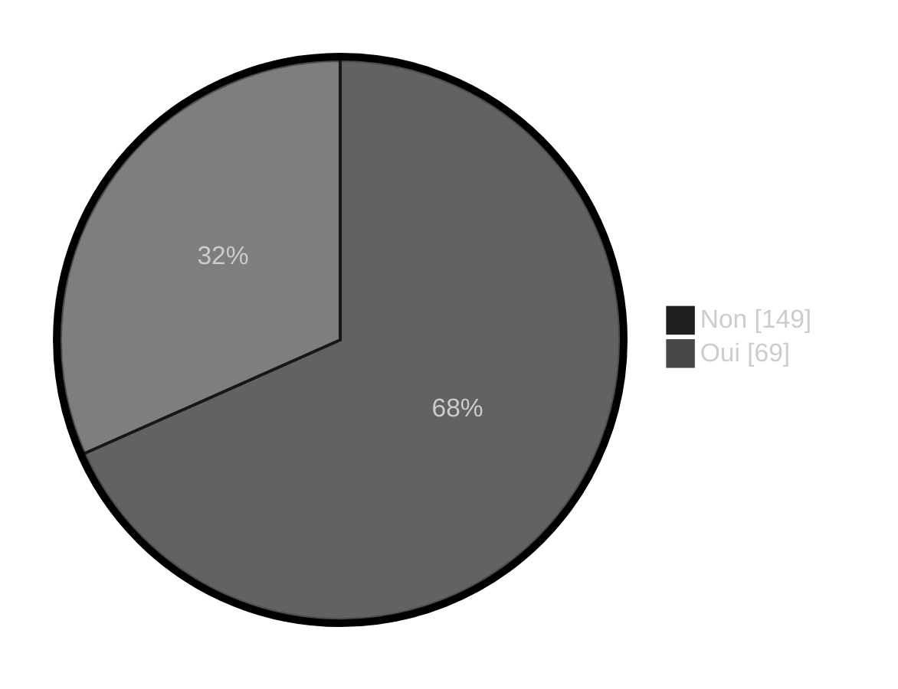
***
## Souhaiteriez-vous télétravailler davantage ?
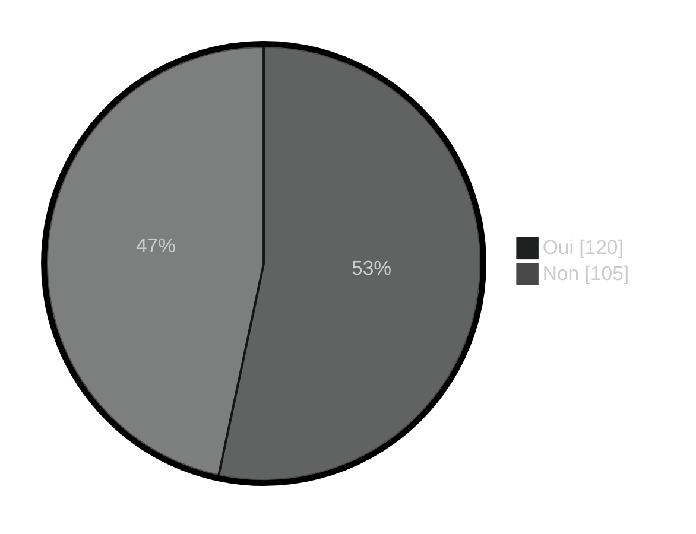
***

