## L'enquête

Les répondantes et répondants de l’enquête lancée entre juin et juillet 2024 par la CGT sont principalement des femmes (67 %). On note un équilibre entre les personnels A (40 %), B (40 %) et un taux de réponse moindre pour les agents de catégorie C (20%) mais, de fait, ils ou elles n’encadrent pas d’équipe (71 %). **En tout, le formulaire nous permet d’exploiter 256 soumissions**.

Plus de la moitié des répondantes et répondants (53%) considèrent que leurs conditions de travail sont moyennes et 20% estiment qu'elles sont mauvaises. Surtout, les collègues trouvent **qu'elles se sont dégradées depuis 2020** (56%). Les principaux motifs d'insatisfaction sont **les effectifs insuffisants, le manque de reconnaissance, le manque de considération**.

Ces conditions de travail dégradées peuvent inciter les personnels à envisager de quitter leur poste (55%) et ils estiment (77%) que **les conditions de travail sont à l'origine de beaucoup de départs** de collègues de services, UFR ou directions. Plus inquiétant, **les conditions de travail dégradées engendrent des problèmes de santé pour 4 répondants sur 10**.

Globalement, **les conditions matérielles sont bonnes**. On relève tout de même que les répondantes et répondants estiment que les conditions de restauration à l’UVSQ sont insuffisantes (131 réponses). Le nombre de réponses est élevé également pour l’ambiance sonore et visuelle sur l’espace de travail.

**La communication à l’UVSQ, en partant des données du questionnaire, semble décriée** : l’information sur Paris Saclay (200), la communication interne à l’université (195), la communication interne à la direction ou composante (150) sont insuffisantes.

Pour ce qui est du management, plusieurs informations à prendre en considération :

– 52 répondantes et répondants indiquent que la prescription des missions se fait par **plusieurs personnes avec des ordres contradictoires**.

– Il ne semble pas y avoir de problème avec le responsable direct (N+1) concernant le fait d’assumer les responsabilités. **Toutefois, on relève un problème aux échelles plus hautes** (+2 et au-dessus).

– On s’étonne que 32 % de répondantes et répondants n’aient pas eu d’entretien professionnel sur ces deux dernières années.

Concernant le télétravail, nous notons que 41 % des répondantes et répondants à la question mentionnent le fait que **la hiérarchie refuse les demandes de télétravail**. De plus, dans 32 % des cas, le nombre de jours est imposé. Sans surprise, **les attentes sont fortes sur ce sujet** : 53 % des répondantes et répondants souhaitent télétravailler davantage. On note également à titre d’information que beaucoup de commentaires libres dans le questionnaire mettent l’accent sur ce sujet (en termes d’attentes et de crispations).

**Le chiffre le plus préoccupant : 48 % (119 réponses) des répondantes et répondants indiquent avoir vécu ou été témoins de situations qui pourraient être qualifiées de harcèlements (moral, sexuel…).**

## Les résultats

### Considérez-vous vos conditions de travail

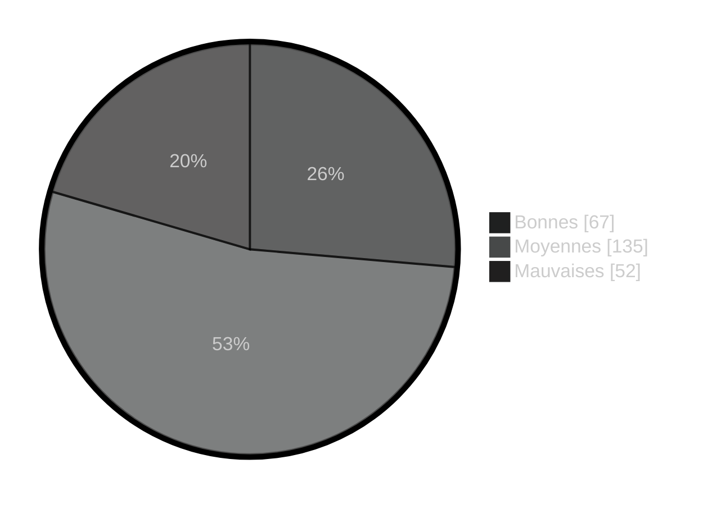
```mermaid
---
config:
  pie:
    textPosition: 0.5
  themeVariables:
    pieOuterStrokeWidth: 5px
  theme: neo-dark
---
pie showData
    title 
    "Bonnes" : 67
    "Moyennes" : 135
    "Mauvaises" : 52
    
    
```
***
### Quels sont vos principaux motifs d’insatisfaction

| Motif d'insatisfaction              | Nombre de réponses |
|-------------------------------------|--------------------:|
| Effectifs insuffisants              |                131 |
| Manque de reconnaissance            |                130 |
| Manque de considération             |                121 |
| Manque d’informations descendantes  |                118 |
| Lourdeur des procédures             |                 97 |
| Mauvaise ambiance                   |                 65 |
| Formations insuffisantes            |                 64 |
| Pression de la hiérarchie           |                 64 |
| Charge de travail trop importante   |                 71 |
| Rythme de travail élevé             |                 48 |
| Mauvaises conditions matérielles    |                 43 |
| Manque d’informations ascendantes   |                 28 |
| Outils trop complexes               |                 25 |

***
### Depuis 2020, considérez-vous que vos conditions de travail 

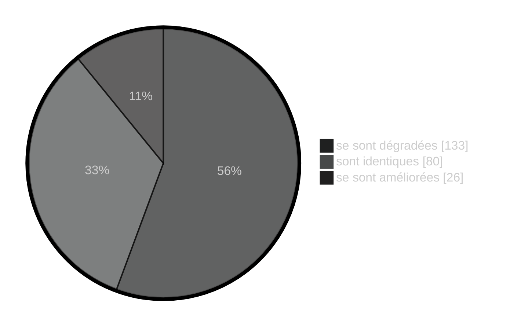
```mermaid
---
config:
  pie:
    textPosition: 0.5
  themeVariables:
    pieOuterStrokeWidth: 5px
  theme: neo-dark
---
pie showData
    title 
    "se sont dégradées" : 133
    "sont identiques" : 80
    "se sont améliorées" : 26
    
    
```

***
### Considérez-vous suffisantes vos conditions matérielles
| Aspect                                                | Suffisant | Insuffisant |
|-------------------------------------------------------|----------:|------------:|
| Vos conditions de restauration                        |       117 |         131 |
| Ambiance sonore et visuelle dans votre espace de travail |       162 |          87 |
| Votre matériel informatique                           |       197 |          55 |
| Votre mobilier                                        |       196 |          52 |
| Votre espace de travail                               |       219 |          33 |

***
### Concernant la détermination de vos missions, quelle est votre situation ?

| Situation                                                                                                              | Nombre de réponses |
|------------------------------------------------------------------------------------------------------------------------|--------------------:|
| Elle est prescrite par un ou une responsable hiérarchique et discutée avec vous                                        |                 86 |
| Elle est prescrite par plusieurs personnes (dont votre responsable hiérarchique) mais de manière coordonnée            |                 58 |
| Elle est prescrite par un ou une seul.e responsable hiérarchique                                                       |                 54 |
| Elle est prescrite par plusieurs personnes (dont votre responsable hiérarchique) avec des ordres contradictoires       |                 52 |

***
### Considérez-vous suffisant :

| Aspect                                                                                                         |  Oui |  Non |
|:---------------------------------------------------------------------------------------------------------------|-----:|-----:|
| L’information sur Paris Saclay                                                                                 |   49 |  200 |
| La communication interne à l’université                                                                        |   56 |  195 |
| La communication interne à votre direction ou composante                                                       |   99 |  150 |
| La reconnaissance de votre supérieur hiérarchique (autre que supérieur hiérarchique direct)                    |  106 |  130 |
| L’information que vous donne votre (vos) supérieur(s) hiérarchique(s)                                          |  125 |  123 |
| La reconnaissance de votre supérieur hiérarchique                                                              |  165 |   81 |
| La confiance que vous accorde votre responsable hiérarchique (autre que responsable hiérarchique direct)       |  156 |   88 |
| Le nombre de rencontres avec votre ou vos supérieurs hiérarchiques                                             |  161 |   89 |
| La confiance que vous accorde votre responsable hiérarchique                                                   |  189 |   60 |
| L’autonomie dont vous bénéficiez                                                                               |  212 |   41 |

### Estimez-vous que votre responsable hiérarchique assume ses responsabilités
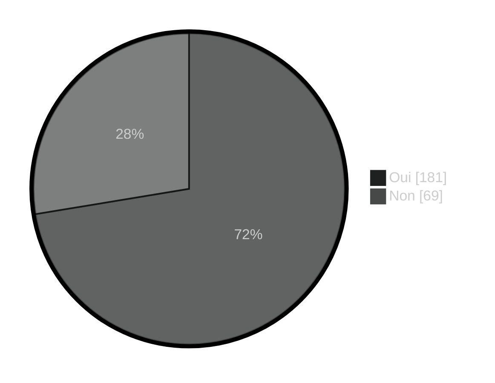
```mermaid
---
config:
  pie:
    textPosition: 0.5
  themeVariables:
    pieOuterStrokeWidth: 5px
  theme: neo-dark
---
pie showData
    "Oui" : 181
    "Non" : 69

```
***
### Estimez-vous que votre hiérarchie (autre que votre responsable hiérarchique direct) assume ses responsabilités

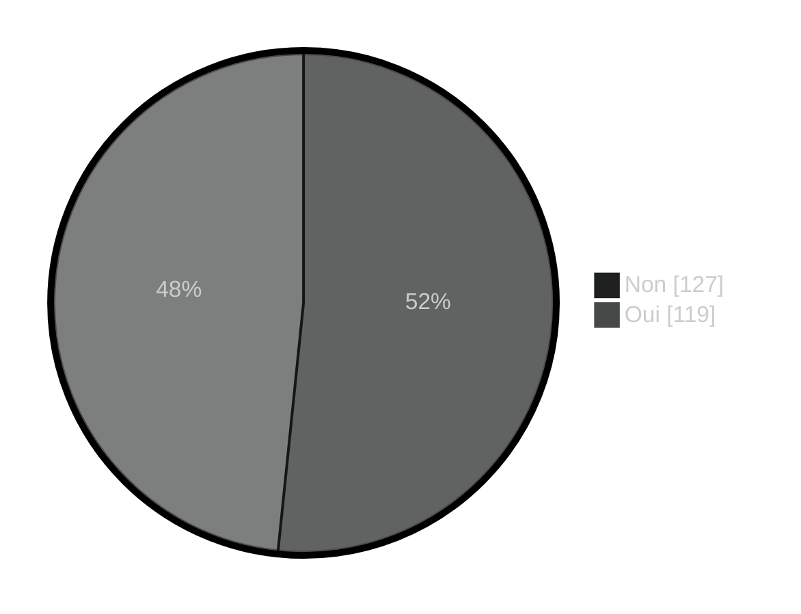
```mermaid
---
config:
  pie:
    textPosition: 0.5
  themeVariables:
    pieOuterStrokeWidth: 5px
  theme: neo-dark
---
pie showData
    "Non" : 127
    "Oui" : 119

```

***
### Est-ce qu'il s'agit de

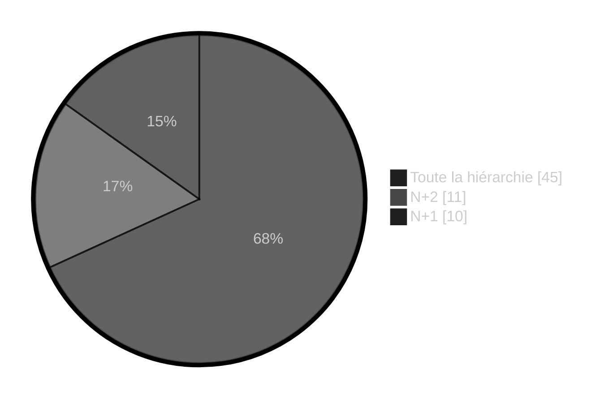
```mermaid
---
config:
  pie:
    textPosition: 0.5
  themeVariables:
    pieOuterStrokeWidth: 5px
  theme: neo-dark
---
pie showData
    "Toute la hiérarchie" : 45
    "N+2" : 11
    "N+1" : 10

```
***
### Êtes-vous en conflit ou en désaccord avec votre supérieur hiérarchique direct

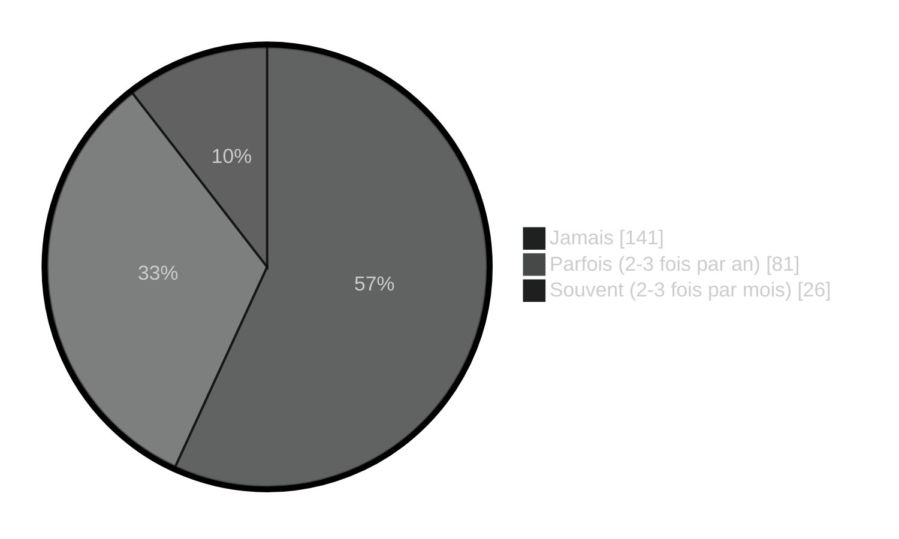
```mermaid
---
config:
  pie:
    textPosition: 0.5
  themeVariables:
    pieOuterStrokeWidth: 5px
  theme: neo-dark
---
pie showData
    "Jamais" : 141
    "Parfois (2-3 fois par an)" : 81
    "Souvent (2-3 fois par mois)" : 26

```
***
### Êtes-vous en conflit avec vos responsables hiérarchiques (autre que le responsable hiérarchique direct)
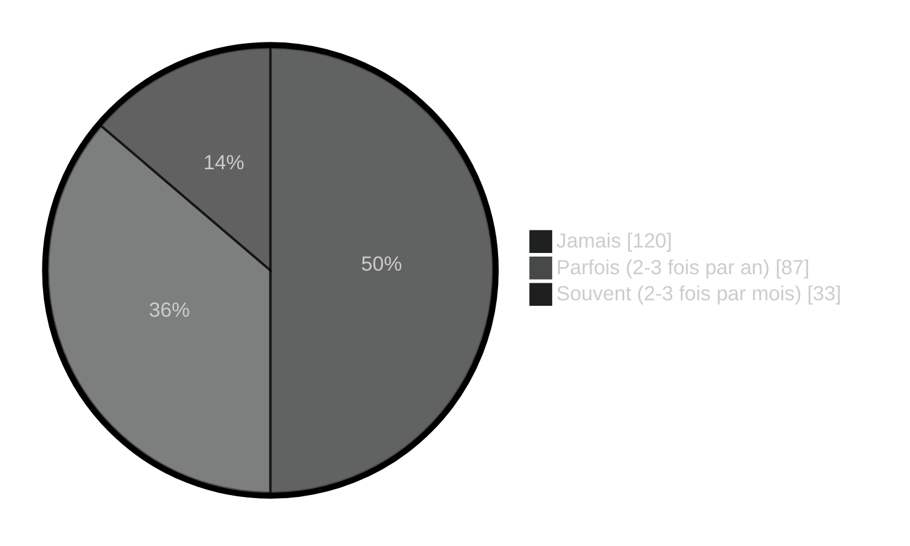
```mermaid
---
config:
  pie:
    textPosition: 0.5
  themeVariables:
    pieOuterStrokeWidth: 5px
  theme: neo-dark
---
pie showData
    "Jamais" : 120
    "Parfois (2-3 fois par an)" : 87
    "Souvent (2-3 fois par mois)" : 33


```
***
### Êtes-vous en conflit avec vos collaborateurs
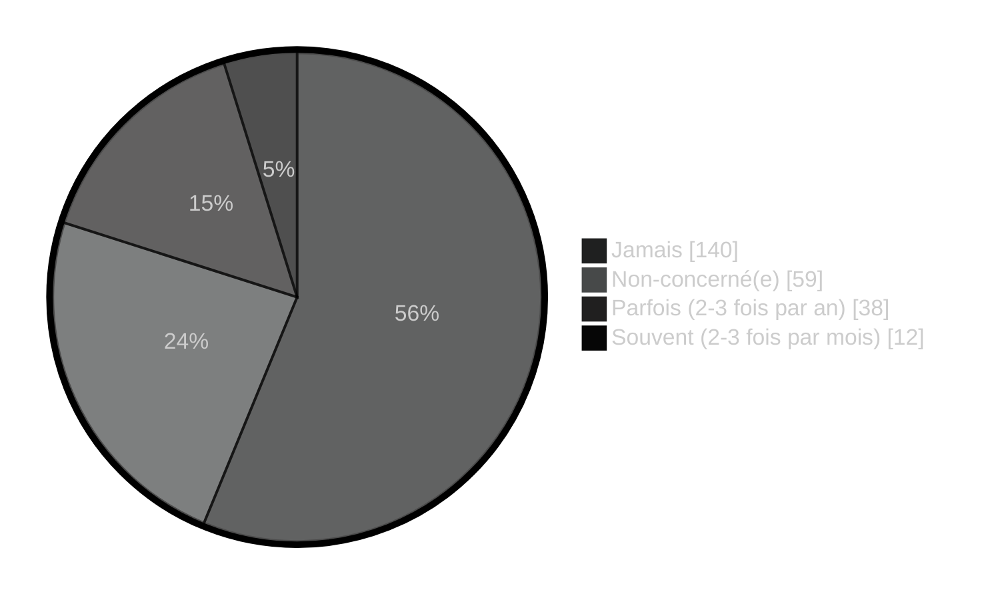
```mermaid
---
config:
  pie:
    textPosition: 0.5
  themeVariables:
    pieOuterStrokeWidth: 5px
  theme: neo-dark
---
pie showData
    "Jamais" : 140
    "Non-concerné(e)" : 59
    "Parfois (2-3 fois par an)" : 38
    "Souvent (2-3 fois par mois)" : 12

```
***
### Êtes-vous en conflit avec vos collègues
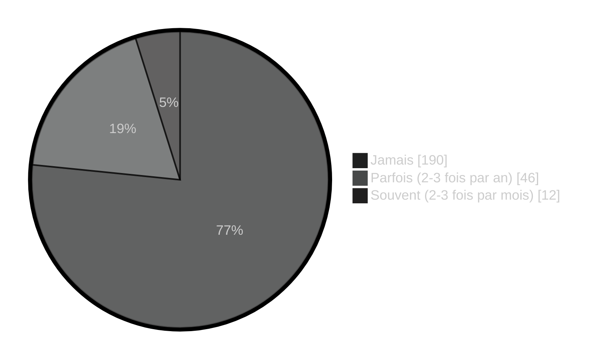
```mermaid
---
config:
  pie:
    textPosition: 0.5
  themeVariables:
    pieOuterStrokeWidth: 5px
  theme: neo-dark
---
pie showData
    "Jamais" : 190
    "Parfois (2-3 fois par an)" : 46
    "Souvent (2-3 fois par mois)" : 12


```
***
### Exercez-vous une partie de votre activité en télétravail ?
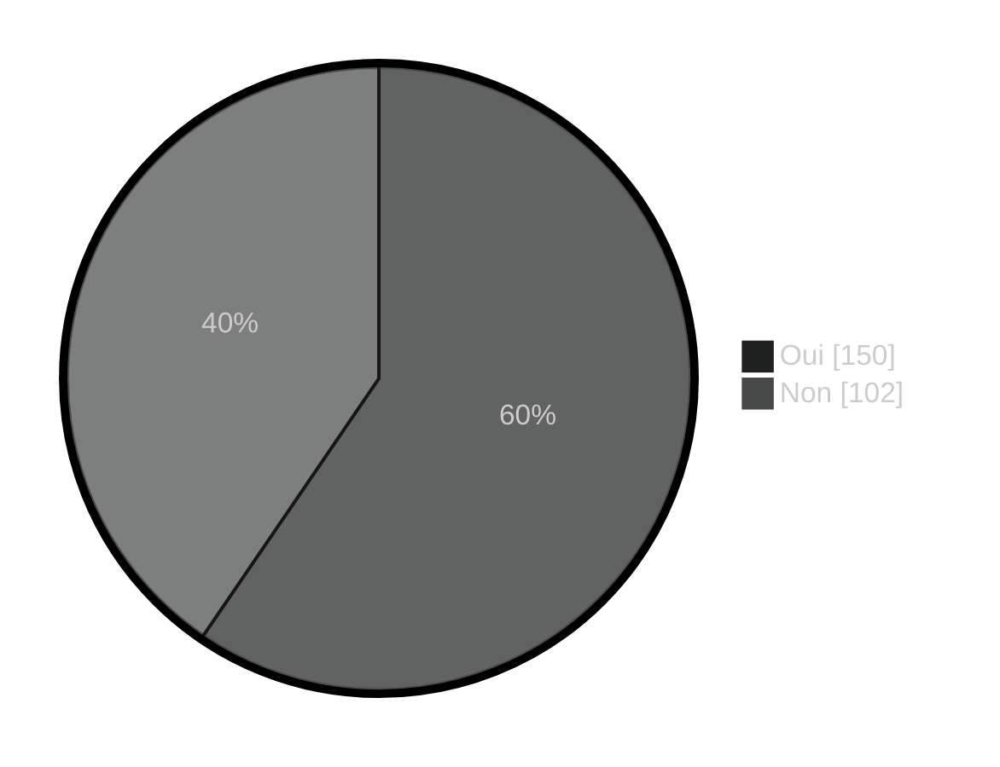
```mermaid
---
config:
  pie:
    textPosition: 0.5
  themeVariables:
    pieOuterStrokeWidth: 5px
  theme: neo-dark
---
pie showData
    "Oui" : 150
    "Non" : 102


```
***
### Si non, vous n'avez pas de télétravail car
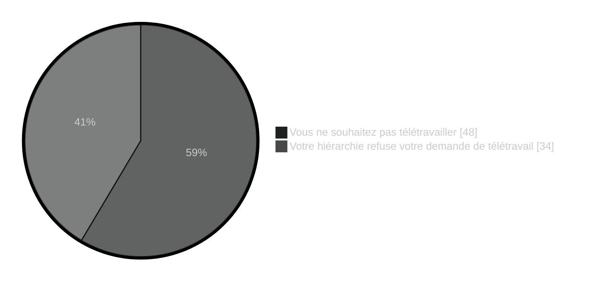
```mermaid
---
config:
  pie:
    textPosition: 0.5
  themeVariables:
    pieOuterStrokeWidth: 5px
  theme: neo-dark
---
pie showData
    "Vous ne souhaitez pas télétravailler" : 48
    "Votre hiérarchie refuse votre demande de télétravail" : 34


```
***
### En moyenne, combien de jours télétravaillez-vous par semaine ?
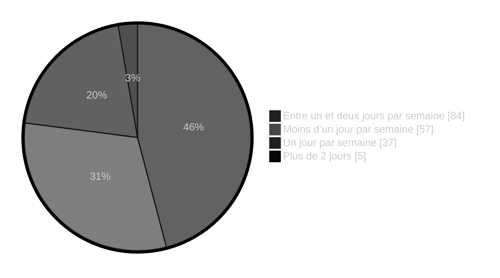
```mermaid
---
config:
  pie:
    textPosition: 0.5
  themeVariables:
    pieOuterStrokeWidth: 5px
  theme: neo-dark
---
pie showData
    "Entre un et deux jours par semaine" : 84
    "Moins d’un jour par semaine" : 57
    "Un jour par semaine" : 37
    "Plus de 2 jours" : 5

```
***
### Est-ce que l'on vous a imposé le nombre de jours en télétravail ?
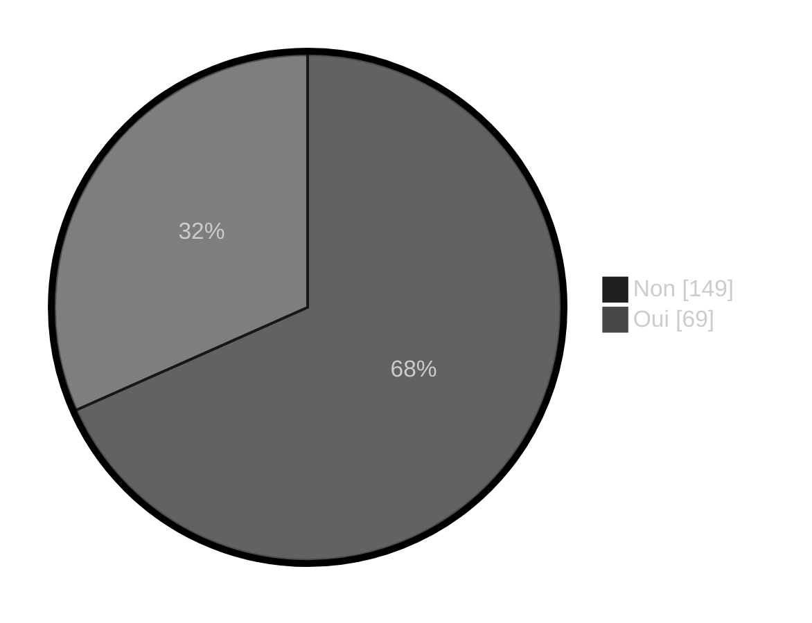
```mermaid
---
config:
  pie:
    textPosition: 0.5
  themeVariables:
    pieOuterStrokeWidth: 5px
  theme: neo-dark
---
pie showData
    "Non" : 149
    "Oui" : 69


```
***
### Souhaiteriez-vous télétravailler davantage ?
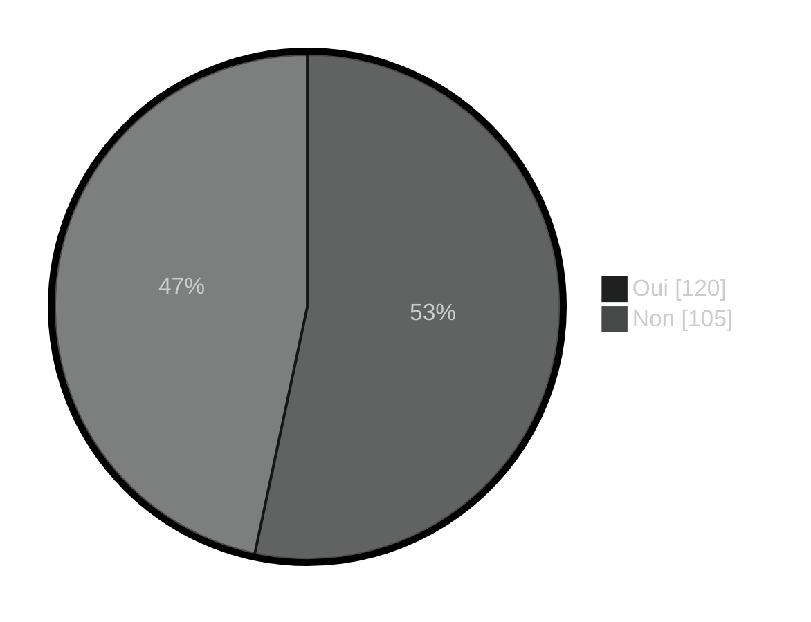
```mermaid
---
config:
  pie:
    textPosition: 0.5
  themeVariables:
    pieOuterStrokeWidth: 5px
  theme: neo-dark
---
pie showData
    "Oui" : 120
    "Non" : 105

```
***
### Depuis combien de temps occupez-vous votre poste actuel ?
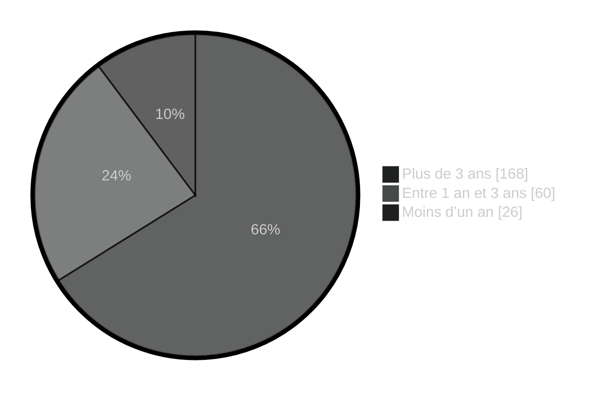
```mermaid
---
config:
  pie:
    textPosition: 0.5
  themeVariables:
    pieOuterStrokeWidth: 5px
  theme: neo-dark
---
pie showData
    "Plus de 3 ans" : 168
    "Entre 1 an et 3 ans" : 60
    "Moins d’un an" : 26

```
***
### Avez-vous une fiche de poste
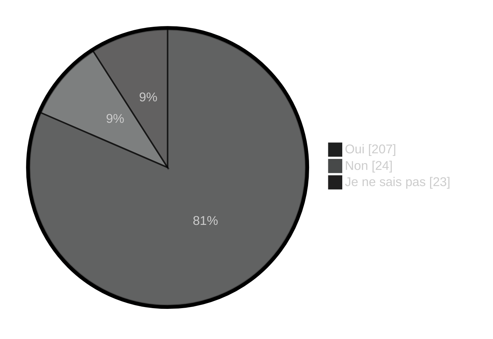
```mermaid
---
config:
  pie:
    textPosition: 0.5
  themeVariables:
    pieOuterStrokeWidth: 5px
  theme: neo-dark
---
pie showData
    "Oui" : 207
    "Non" : 24
    "Je ne sais pas" : 23

```
***
### Si oui, votre fiche de poste correspond-elle à vos missions ?
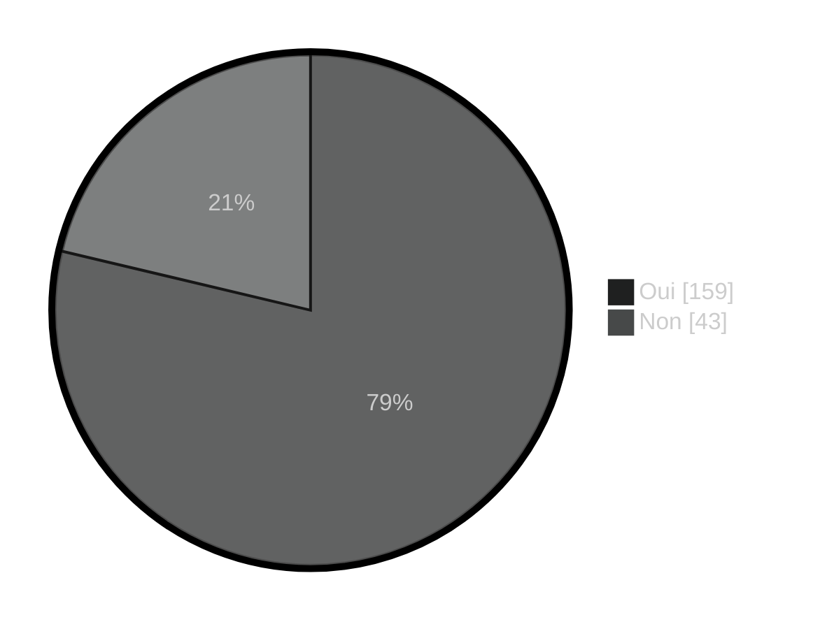
```mermaid
---
config:
  pie:
    textPosition: 0.5
  themeVariables:
    pieOuterStrokeWidth: 5px
  theme: neo-dark
---
pie showData
    "Oui" : 159
    "Non" : 43

```
***
### Votre poste correspond-il à vos compétences ?
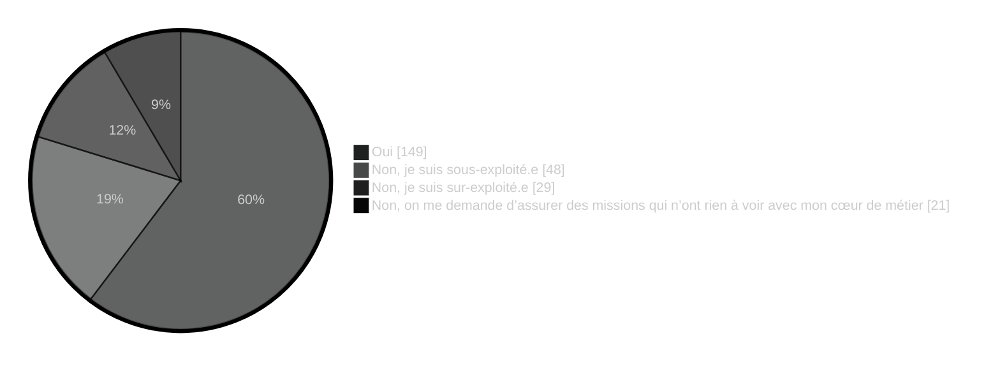
```mermaid
---
config:
  pie:
    textPosition: 0.5
  themeVariables:
    pieOuterStrokeWidth: 5px
  theme: neo-dark
---
pie showData
    "Oui" : 149
    "Non, je suis sous-exploité.e" : 48
    "Non, je suis sur-exploité.e" : 29
    "Non, on me demande d’assurer des missions qui n’ont rien à voir avec mon cœur de métier" : 21

```
***
### Souhaiteriez-vous voir évoluer vos missions ?
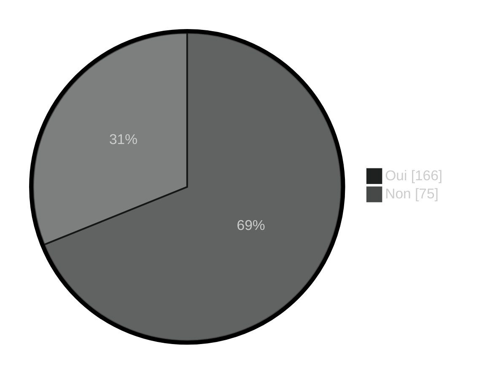
```mermaid
---
config:
  pie:
    textPosition: 0.5
  themeVariables:
    pieOuterStrokeWidth: 5px
  theme: neo-dark
---
pie showData
    "Oui" : 166
    "Non" : 75

```
***
### Avez-vous envisagé de changer de poste à cause de vos conditions de travail ?
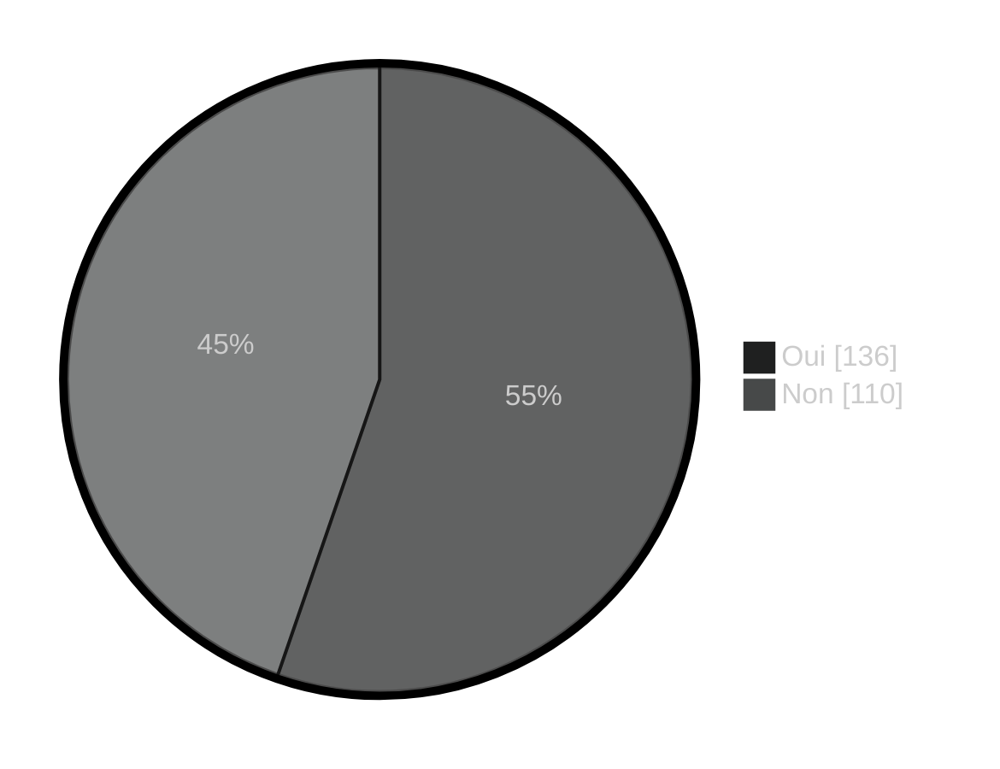
```mermaid
---
config:
  pie:
    textPosition: 0.5
  themeVariables:
    pieOuterStrokeWidth: 5px
  theme: neo-dark
---
pie showData
    "Oui" : 136
    "Non" : 110

```
***
### Dans votre service, UFR, ou direction y a-t-il des collègues qui ont quitté (le service, l’UFR, la direction) pour des raisons liées aux conditions de travail ?
```mermaid
---
config:
  pie:
    textPosition: 0.5
  themeVariables:
    pieOuterStrokeWidth: 5px
  theme: neo-dark
---
pie showData
    "Oui" : 189
    "Non" : 55

```
***
### Avez-vous eu un entretien professionnel avec votre hiérarchie ces deux dernières années ?
```mermaid
---
config:
  pie:
    textPosition: 0.5
  themeVariables:
    pieOuterStrokeWidth: 5px
  theme: neo-dark
---
pie showData
    "Oui" : 170
    "Non" : 79

```
***
### Si oui, étiez-vous en accord avec le contenu final de votre entretien professionnel ?
```mermaid
---
config:
  pie:
    textPosition: 0.5
  themeVariables:
    pieOuterStrokeWidth: 5px
  theme: neo-dark
---
pie showData
    "Oui" : 140
    "Non" : 54

```
***
### Vos conditions de travail ont-elles engendré des conséquences sur votre état de santé (traitement médical, arrêt maladie) ?
```mermaid
---
config:
  pie:
    textPosition: 0.5
  themeVariables:
    pieOuterStrokeWidth: 5px
  theme: neo-dark
---
pie showData
    "Non" : 152
    "Oui" : 102

```
***
### Avez-vous déjà consulté le médecin de prévention de l’UVSQ concernant la dégradation de votre état de santé en lien avec vos conditions de travail ?
```mermaid
---
config:
  pie:
    textPosition: 0.5
  themeVariables:
    pieOuterStrokeWidth: 5px
  theme: neo-dark
---
pie showData
    "Non" : 197
    "Oui" : 54

```
***
### Si oui, est-ce que la situation s'est améliorée au sujet de vos conditions de travail ?
```mermaid
---
config:
  pie:
    textPosition: 0.5
  themeVariables:
    pieOuterStrokeWidth: 5px
  theme: neo-dark
---
pie showData
    "Non" : 38
    "Oui" : 15

```
***
### Avez-vous vécu ou été témoin de situations qui selon vous pourraient être qualifiées de harcèlement (moral, sexuel…)
```mermaid
---
config:
  pie:
    textPosition: 0.5
  themeVariables:
    pieOuterStrokeWidth: 5px
  theme: neo-dark
---
pie showData
    "Non" : 129
    "Oui" : 119

```
***
### Êtes-vous :
```mermaid
---
config:
  pie:
    textPosition: 0.5
  themeVariables:
    pieOuterStrokeWidth: 5px
  theme: neo-dark
---
pie showData
    "Une femme" : 170
    "Un homme" : 82

```
***
### Votre catégorie (en tant que titulaire ou contractuel) ?
```mermaid
---
config:
  pie:
    textPosition: 0.5
  themeVariables:
    pieOuterStrokeWidth: 5px
  theme: neo-dark
---
pie showData
    "A" : 101
    "B" : 101
    "C" : 48

```
***
### Encadrez-vous une équipe ?
```mermaid
---
config:
  pie:
    textPosition: 0.5
  themeVariables:
    pieOuterStrokeWidth: 5px
  theme: neo-dark
---
pie showData
    "Non" : 179
    "Oui" : 74

```
***
### Trouvez-vous encore du sens à votre travail ?
```mermaid
---
config:
  pie:
    textPosition: 0.5
  themeVariables:
    pieOuterStrokeWidth: 5px
  theme: neo-dark
---
pie showData
    "Oui" : 171
    "Non" : 78

```
***

