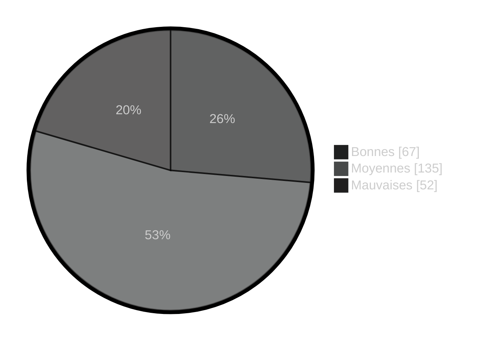
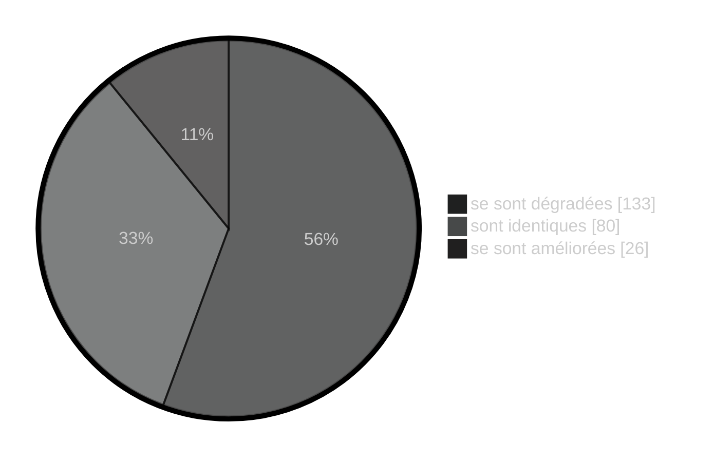
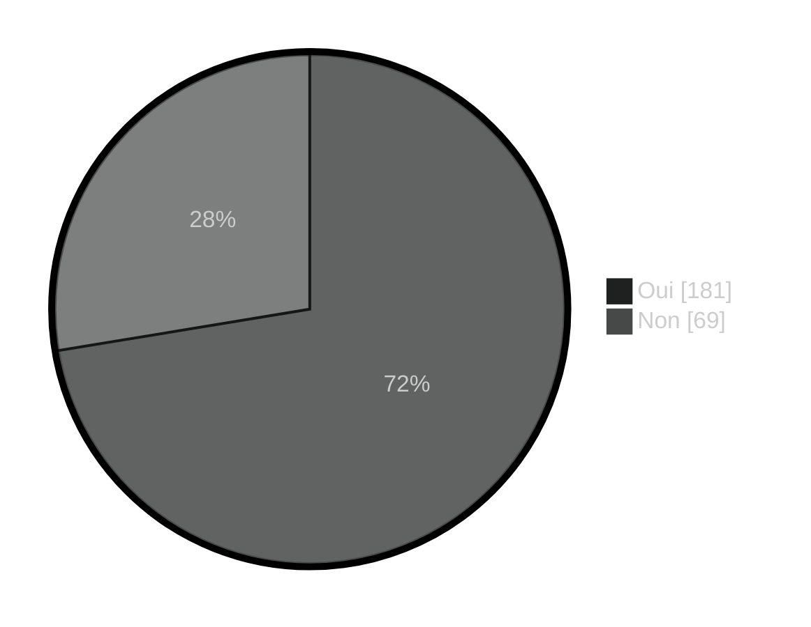
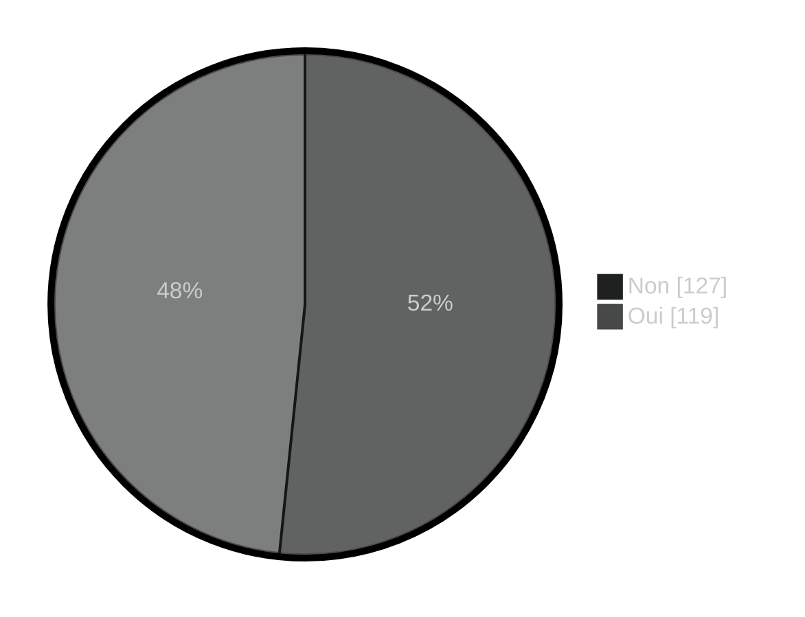
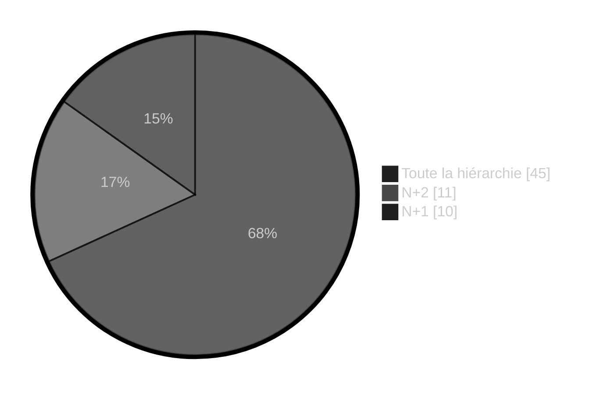
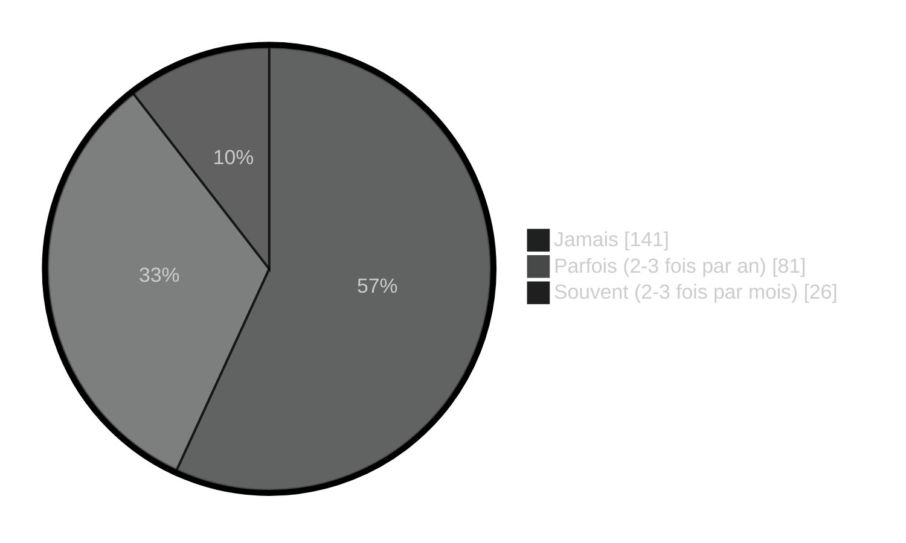

## Considérez-vous vos conditions de travail

***
## Depuis 2020, considérez-vous que vos conditions de travail 

***

### Estimez-vous que votre responsable hiérarchique assume ses responsabilités

***
## Estimez-vous que votre hiérarchie (autre que votre responsable hiérarchique direct) assume ses responsabilités

***
## Est-ce qu'il s'agit de

***
## Êtes-vous en conflit ou en désaccord avec votre supérieur hiérarchique direct

***

