## Considérez-vous vos conditions de travail

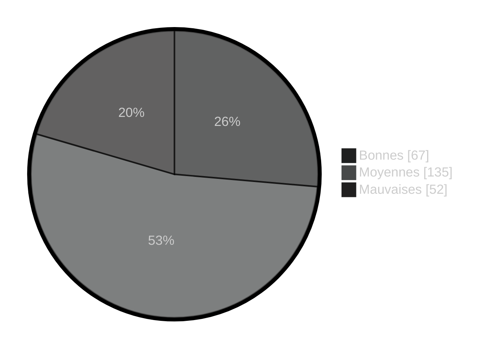
```mermaid
---
config:
  pie:
    textPosition: 0.5
  themeVariables:
    pieOuterStrokeWidth: 5px
  theme: neo-dark
---
pie showData
    title 
    "Bonnes" : 67
    "Moyennes" : 135
    "Mauvaises" : 52
    
    
```
***
## Depuis 2020, considérez-vous que vos conditions de travail 

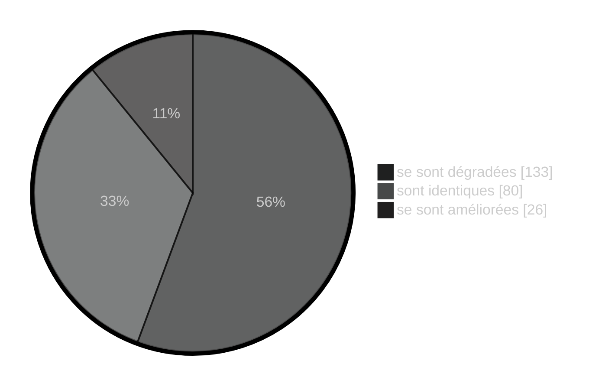
```mermaid
---
config:
  pie:
    textPosition: 0.5
  themeVariables:
    pieOuterStrokeWidth: 5px
  theme: neo-dark
---
pie showData
    title 
    "se sont dégradées" : 133
    "sont identiques" : 80
    "se sont améliorées" : 26
    
    
```

***

### Estimez-vous que votre responsable hiérarchique assume ses responsabilités
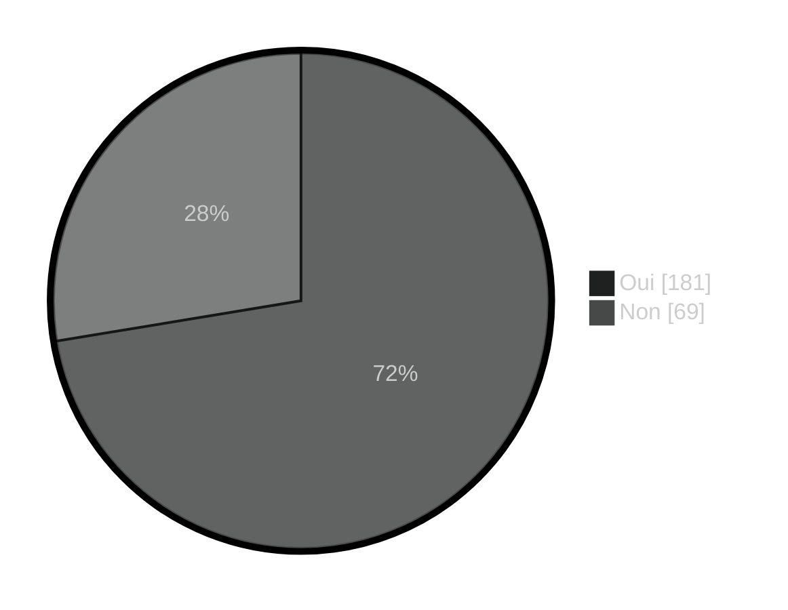
```mermaid
---
config:
  pie:
    textPosition: 0.5
  themeVariables:
    pieOuterStrokeWidth: 5px
  theme: neo-dark
---
pie showData
    "Oui" : 181
    "Non" : 69

```
***
## Estimez-vous que votre hiérarchie (autre que votre responsable hiérarchique direct) assume ses responsabilités

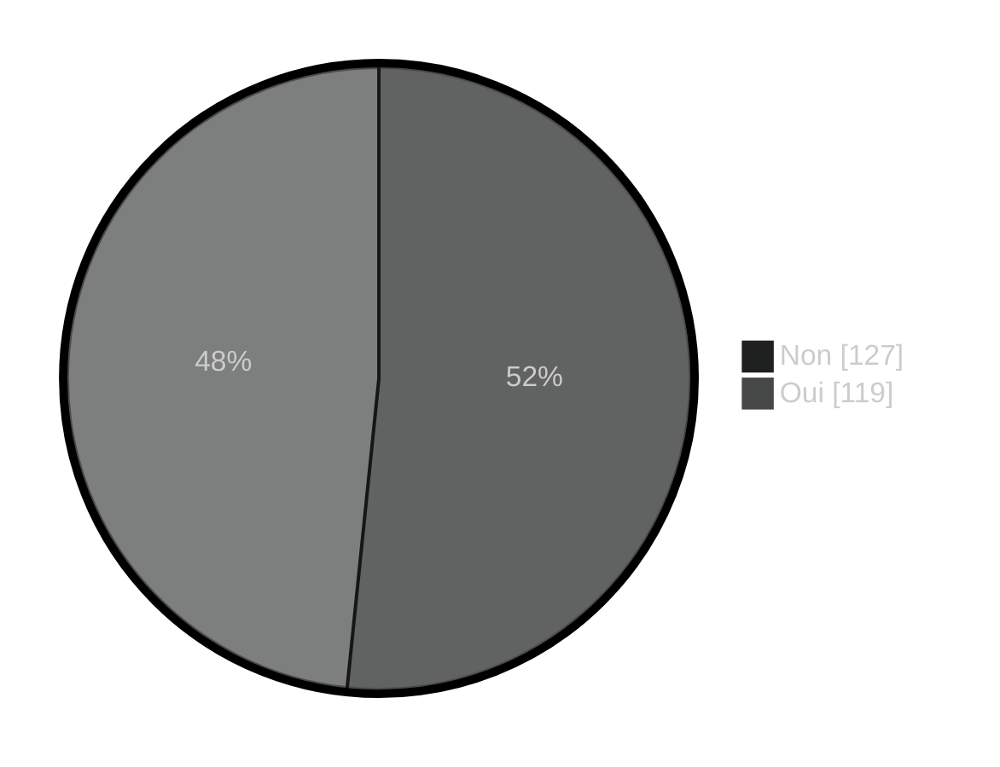
```mermaid
---
config:
  pie:
    textPosition: 0.5
  themeVariables:
    pieOuterStrokeWidth: 5px
  theme: neo-dark
---
pie showData
    "Non" : 127
    "Oui" : 119

```

***
## Est-ce qu'il s'agit de

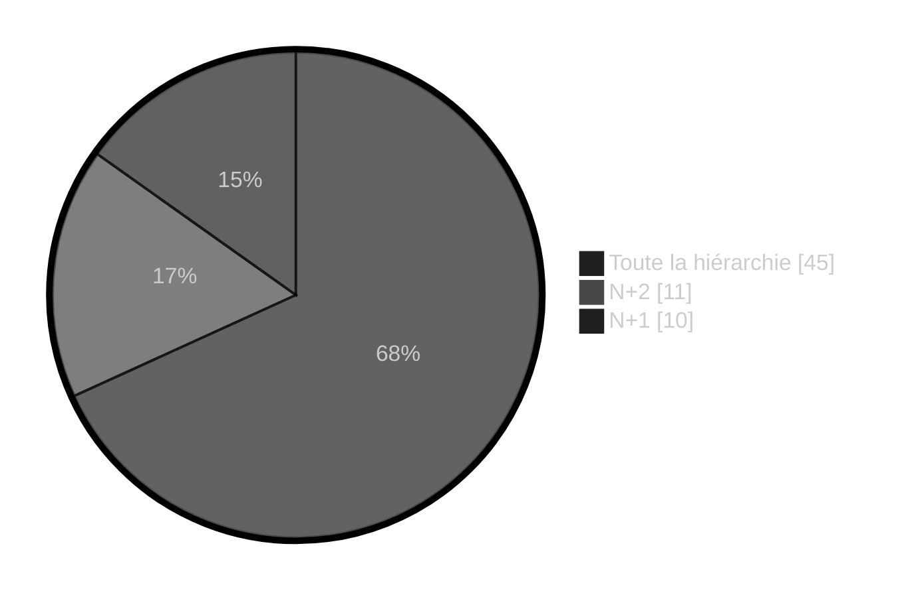
```mermaid
---
config:
  pie:
    textPosition: 0.5
  themeVariables:
    pieOuterStrokeWidth: 5px
  theme: neo-dark
---
pie showData
    "Toute la hiérarchie" : 45
    "N+2" : 11
    "N+1" : 10

```
***
## Êtes-vous en conflit ou en désaccord avec votre supérieur hiérarchique direct

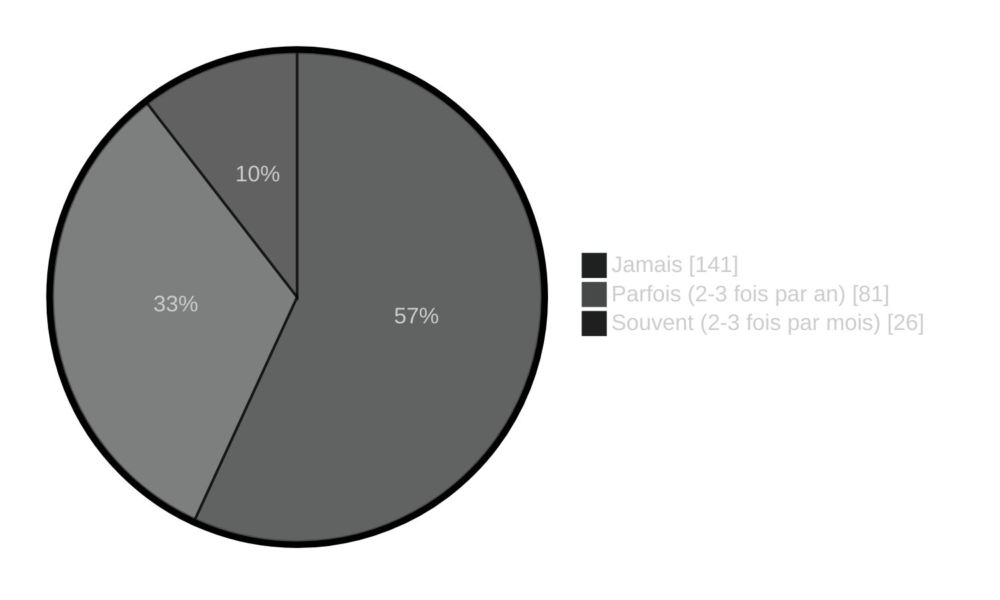
```mermaid
---
config:
  pie:
    textPosition: 0.5
  themeVariables:
    pieOuterStrokeWidth: 5px
  theme: neo-dark
---
pie showData
    "Jamais" : 141
    "Parfois (2-3 fois par an)" : 81
    "Souvent (2-3 fois par mois)" : 26

```
***
## Êtes-vous en conflit avec vos responsables hiérarchiques (autre que le responsable hiérarchique direct)
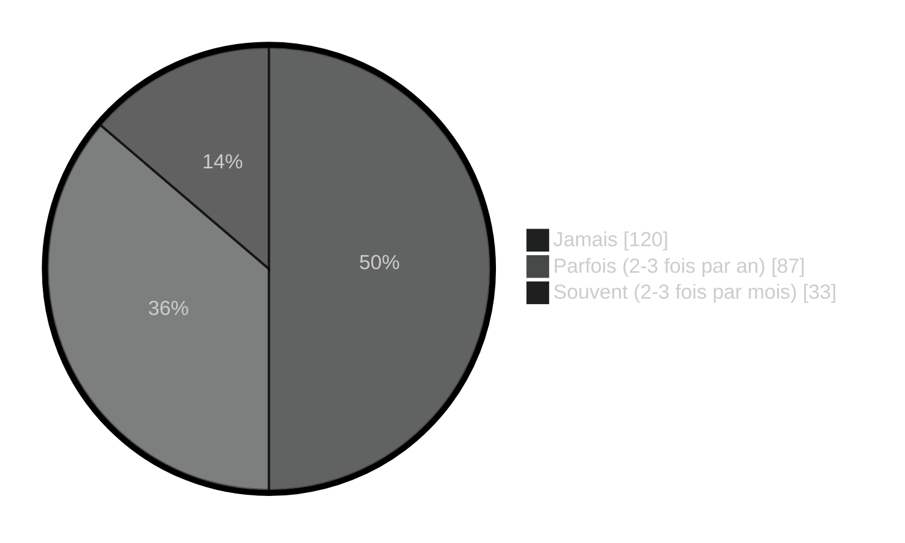
```mermaid
---
config:
  pie:
    textPosition: 0.5
  themeVariables:
    pieOuterStrokeWidth: 5px
  theme: neo-dark
---
pie showData
    "Jamais" : 120
    "Parfois (2-3 fois par an)" : 87
    "Souvent (2-3 fois par mois)" : 33


```
***
## Êtes-vous en conflit avec vos collaborateurs
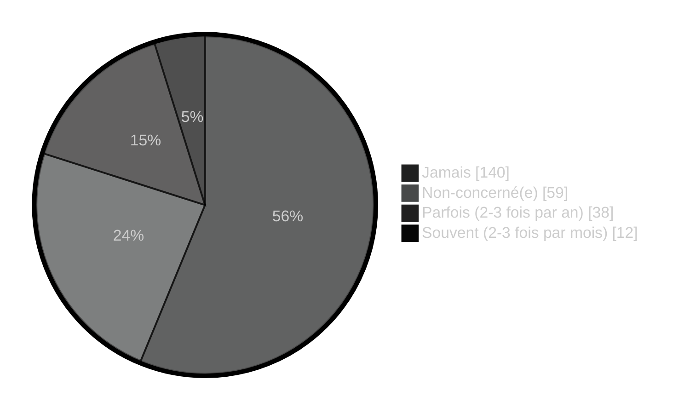
```mermaid
---
config:
  pie:
    textPosition: 0.5
  themeVariables:
    pieOuterStrokeWidth: 5px
  theme: neo-dark
---
pie showData
    "Jamais" : 140
    "Non-concerné(e)" : 59
    "Parfois (2-3 fois par an)" : 38
    "Souvent (2-3 fois par mois)" : 12

```
***
## Êtes-vous en conflit avec vos collègues
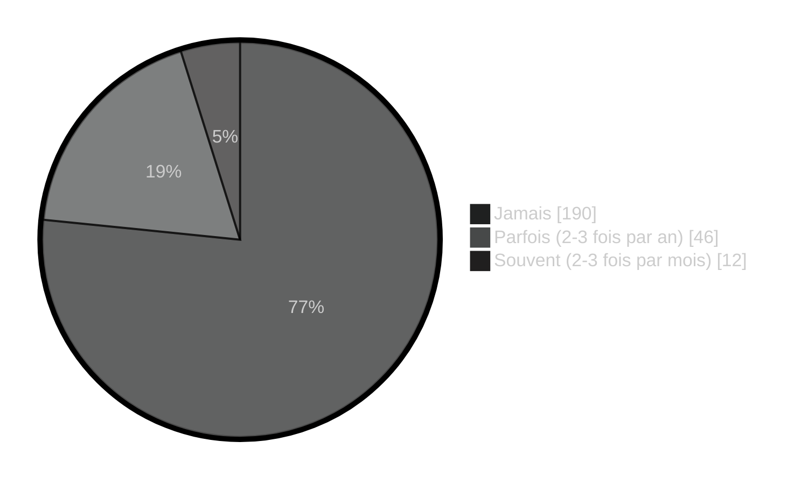
```mermaid
---
config:
  pie:
    textPosition: 0.5
  themeVariables:
    pieOuterStrokeWidth: 5px
  theme: neo-dark
---
pie showData
    "Jamais" : 190
    "Parfois (2-3 fois par an)" : 46
    "Souvent (2-3 fois par mois)" : 12


```
***
## Exercez-vous une partie de votre activité en télétravail ?
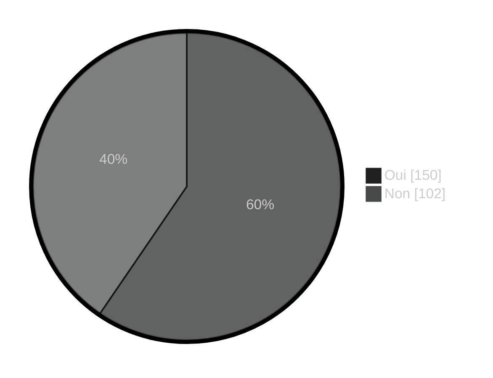
```mermaid
---
config:
  pie:
    textPosition: 0.5
  themeVariables:
    pieOuterStrokeWidth: 5px
  theme: neo-dark
---
pie showData
    "Oui" : 150
    "Non" : 102


```
***
## Si non, vous n'avez pas de télétravail car
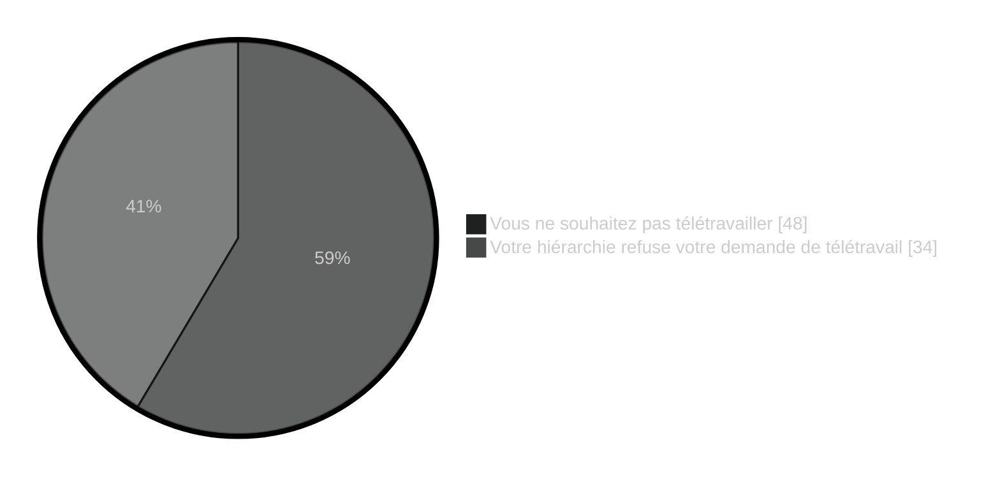
```mermaid
---
config:
  pie:
    textPosition: 0.5
  themeVariables:
    pieOuterStrokeWidth: 5px
  theme: neo-dark
---
pie showData
    "Vous ne souhaitez pas télétravailler" : 48
    "Votre hiérarchie refuse votre demande de télétravail" : 34


```
***
## En moyenne, combien de jours télétravaillez-vous par semaine ?
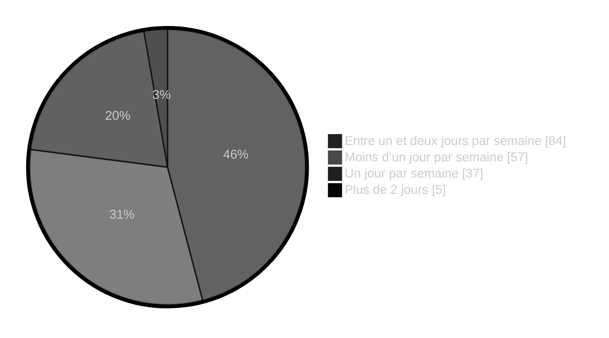
```mermaid
---
config:
  pie:
    textPosition: 0.5
  themeVariables:
    pieOuterStrokeWidth: 5px
  theme: neo-dark
---
pie showData
    "Entre un et deux jours par semaine" : 84
    "Moins d’un jour par semaine" : 57
    "Un jour par semaine" : 37
    "Plus de 2 jours" : 5

```
***
## Est-ce que l'on vous a imposé le nombre de jours en télétravail ?
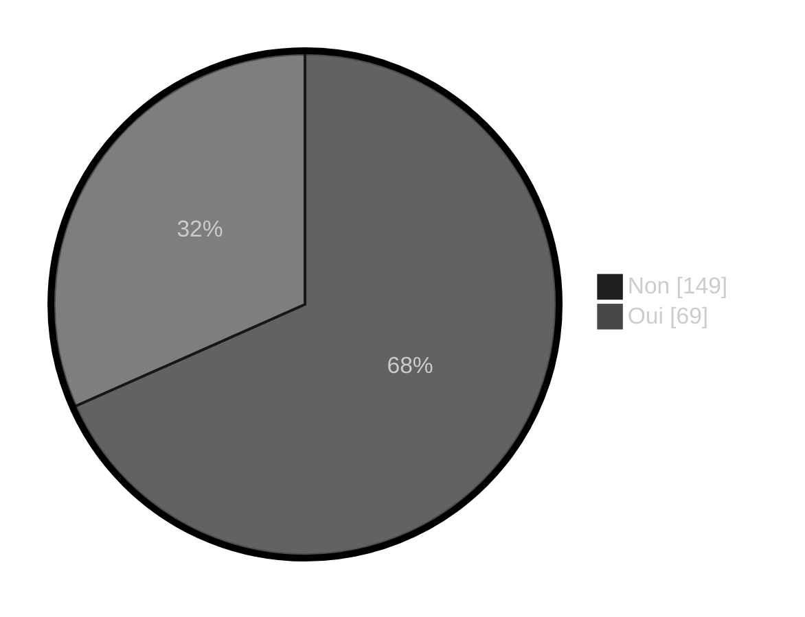
```mermaid
---
config:
  pie:
    textPosition: 0.5
  themeVariables:
    pieOuterStrokeWidth: 5px
  theme: neo-dark
---
pie showData
    "Non" : 149
    "Oui" : 69


```
***
## Souhaiteriez-vous télétravailler davantage ?
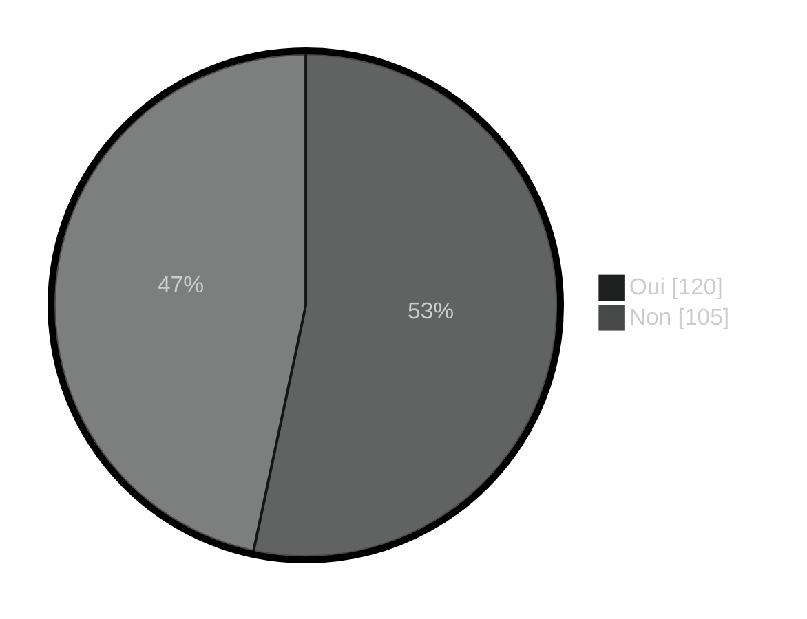
```mermaid
---
config:
  pie:
    textPosition: 0.5
  themeVariables:
    pieOuterStrokeWidth: 5px
  theme: neo-dark
---
pie showData
    "Oui" : 120
    "Non" : 105

```
***
## Depuis combien de temps occupez-vous votre poste actuel ?
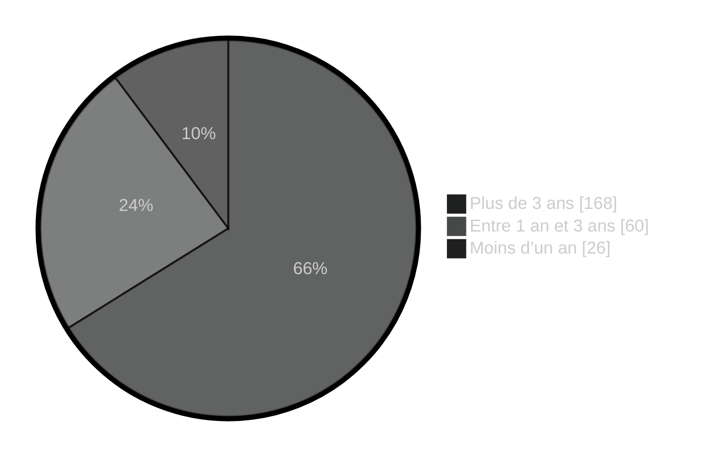
```mermaid
---
config:
  pie:
    textPosition: 0.5
  themeVariables:
    pieOuterStrokeWidth: 5px
  theme: neo-dark
---
pie showData
    "Plus de 3 ans" : 168
    "Entre 1 an et 3 ans" : 60
    "Moins d’un an" : 26

```
***
## Avez-vous une fiche de poste
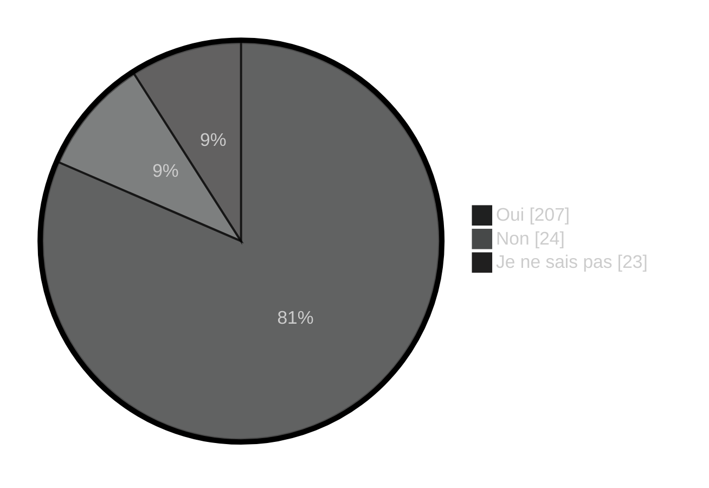
```mermaid
---
config:
  pie:
    textPosition: 0.5
  themeVariables:
    pieOuterStrokeWidth: 5px
  theme: neo-dark
---
pie showData
    "Oui" : 207
    "Non" : 24
    "Je ne sais pas" : 23

```
***
## Si oui, votre fiche de poste correspond-elle à vos missions ?
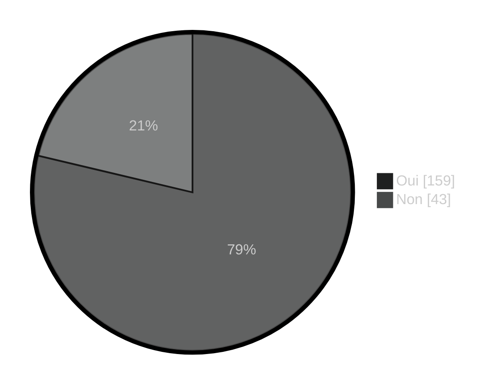
```mermaid
---
config:
  pie:
    textPosition: 0.5
  themeVariables:
    pieOuterStrokeWidth: 5px
  theme: neo-dark
---
pie showData
    "Oui" : 159
    "Non" : 43

```
***
## Votre poste correspond-il à vos compétences ?
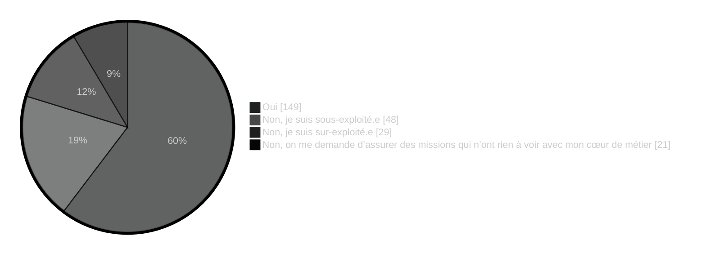
```mermaid
---
config:
  pie:
    textPosition: 0.5
  themeVariables:
    pieOuterStrokeWidth: 5px
  theme: neo-dark
---
pie showData
    "Oui" : 149
    "Non, je suis sous-exploité.e" : 48
    "Non, je suis sur-exploité.e" : 29
    "Non, on me demande d’assurer des missions qui n’ont rien à voir avec mon cœur de métier" : 21

```
***
## Souhaiteriez-vous voir évoluer vos missions ?
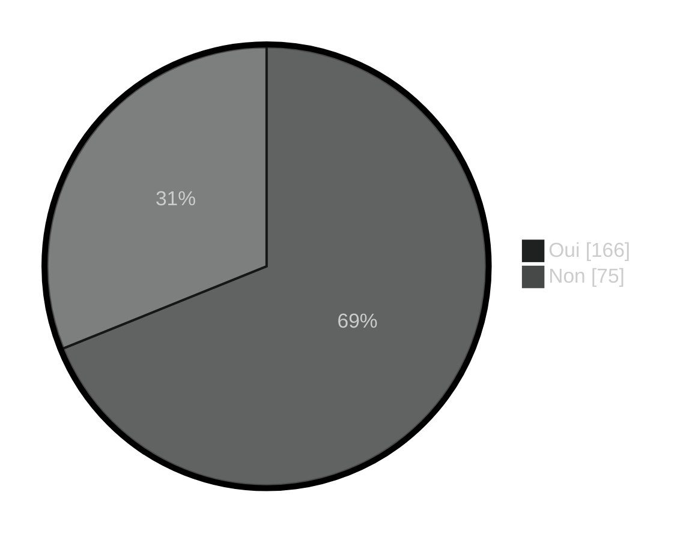
```mermaid
---
config:
  pie:
    textPosition: 0.5
  themeVariables:
    pieOuterStrokeWidth: 5px
  theme: neo-dark
---
pie showData
    "Oui" : 166
    "Non" : 75

```
***
## Avez-vous envisagé de changer de poste à cause de vos conditions de travail ?
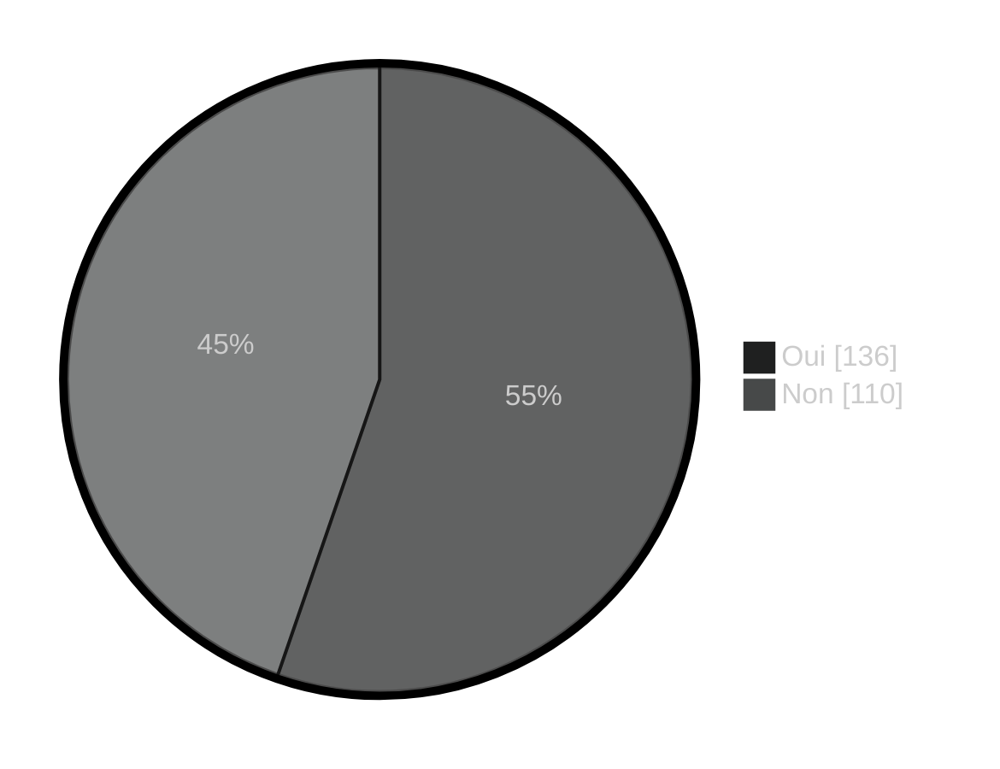
```mermaid
---
config:
  pie:
    textPosition: 0.5
  themeVariables:
    pieOuterStrokeWidth: 5px
  theme: neo-dark
---
pie showData
    "Oui" : 136
    "Non" : 110

```
***
## Dans votre service, UFR, ou direction y a-t-il des collègues qui ont quitté (le service, l’UFR, la direction) pour des raisons liées aux conditions de travail ?
```mermaid
---
config:
  pie:
    textPosition: 0.5
  themeVariables:
    pieOuterStrokeWidth: 5px
  theme: neo-dark
---
pie showData
    "Oui" : 189
    "Non" : 55

```
***
## Avez-vous eu un entretien professionnel avec votre hiérarchie ces deux dernières années ?
```mermaid
---
config:
  pie:
    textPosition: 0.5
  themeVariables:
    pieOuterStrokeWidth: 5px
  theme: neo-dark
---
pie showData
    "Oui" : 170
    "Non" : 79

```
***
## Si oui, étiez-vous en accord avec le contenu final de votre entretien professionnel ?
```mermaid
---
config:
  pie:
    textPosition: 0.5
  themeVariables:
    pieOuterStrokeWidth: 5px
  theme: neo-dark
---
pie showData
    "Oui" : 140
    "Non" : 54

```
***
## Vos conditions de travail ont-elles engendré des conséquences sur votre état de santé (traitement médical, arrêt maladie) ?
```mermaid
---
config:
  pie:
    textPosition: 0.5
  themeVariables:
    pieOuterStrokeWidth: 5px
  theme: neo-dark
---
pie showData
    "Non" : 152
    "Oui" : 102

```
***
## Avez-vous déjà consulté le médecin de prévention de l’UVSQ concernant la dégradation de votre état de santé en lien avec vos conditions de travail ?
```mermaid
---
config:
  pie:
    textPosition: 0.5
  themeVariables:
    pieOuterStrokeWidth: 5px
  theme: neo-dark
---
pie showData
    "Non" : 197
    "Oui" : 54

```
***
## Si oui, est-ce que la situation s'est améliorée au sujet de vos conditions de travail ?
```mermaid
---
config:
  pie:
    textPosition: 0.5
  themeVariables:
    pieOuterStrokeWidth: 5px
  theme: neo-dark
---
pie showData
    "Non" : 38
    "Oui" : 15

```
***
## Avez-vous vécu ou été témoin de situations qui selon vous pourraient être qualifiées de harcèlement (moral, sexuel…)
```mermaid
---
config:
  pie:
    textPosition: 0.5
  themeVariables:
    pieOuterStrokeWidth: 5px
  theme: neo-dark
---
pie showData
    "Non" : 129
    "Oui" : 119

```
***
## Êtes-vous :
```mermaid
---
config:
  pie:
    textPosition: 0.5
  themeVariables:
    pieOuterStrokeWidth: 5px
  theme: neo-dark
---
pie showData
    "Une femme" : 170
    "Un homme" : 82

```
***
## Votre catégorie (en tant que titulaire ou contractuel) ?
```mermaid
---
config:
  pie:
    textPosition: 0.5
  themeVariables:
    pieOuterStrokeWidth: 5px
  theme: neo-dark
---
pie showData
    "A" : 101
    "B" : 101
    "C" : 48

```
***
## Encadrez-vous une équipe ?
```mermaid
---
config:
  pie:
    textPosition: 0.5
  themeVariables:
    pieOuterStrokeWidth: 5px
  theme: neo-dark
---
pie showData
    "Non" : 179
    "Oui" : 74

```
***
## Trouvez-vous encore du sens à votre travail ?
```mermaid
---
config:
  pie:
    textPosition: 0.5
  themeVariables:
    pieOuterStrokeWidth: 5px
  theme: neo-dark
---
pie showData
    "Oui" : 171
    "Non" : 78

```
***

