## Considérez-vous vos conditions de travail

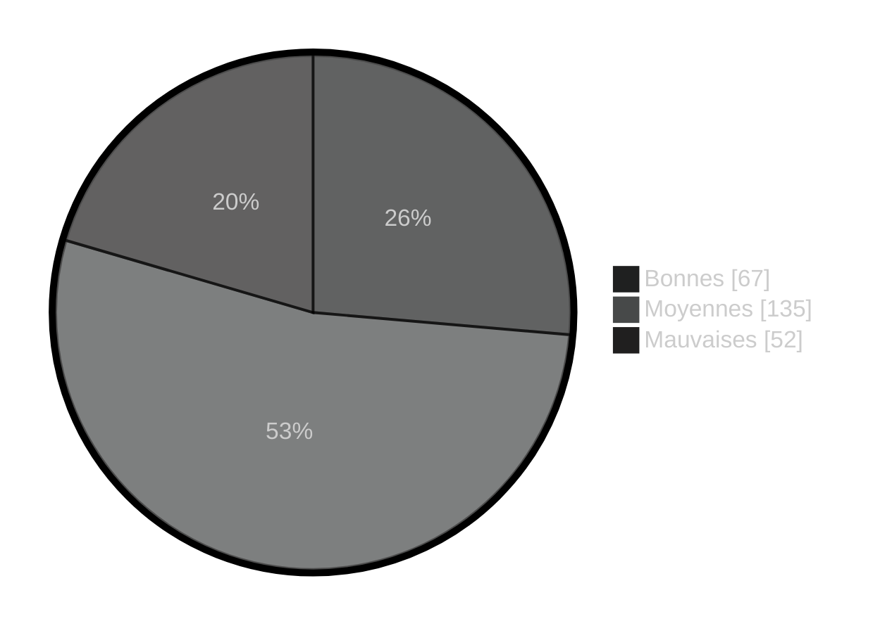
```mermaid
---
config:
  pie:
    textPosition: 0.5
  themeVariables:
    pieOuterStrokeWidth: 5px
  theme: neo-dark
---
pie showData
    title 
    "Bonnes" : 67
    "Moyennes" : 135
    "Mauvaises" : 52
    
    
```
***
## Depuis 2020, considérez-vous que vos conditions de travail 

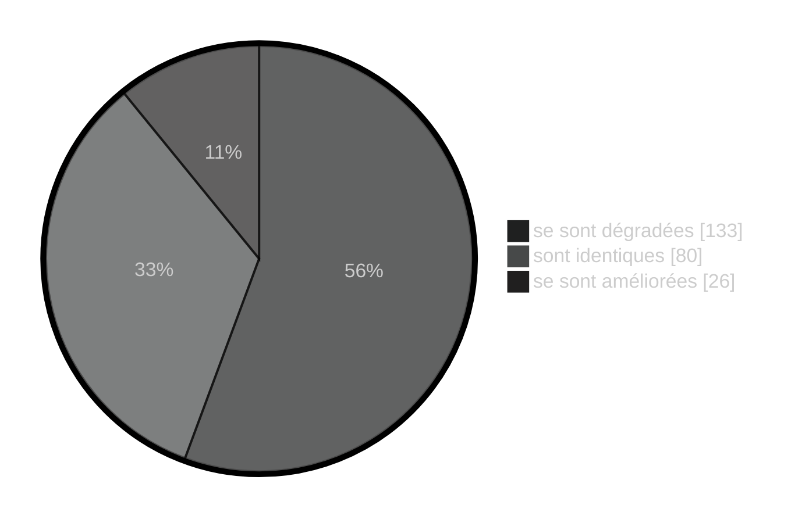
```mermaid
---
config:
  pie:
    textPosition: 0.5
  themeVariables:
    pieOuterStrokeWidth: 5px
  theme: neo-dark
---
pie showData
    title 
    "se sont dégradées" : 133
    "sont identiques" : 80
    "se sont améliorées" : 26
    
    
```

***

### Estimez-vous que votre responsable hiérarchique assume ses responsabilités
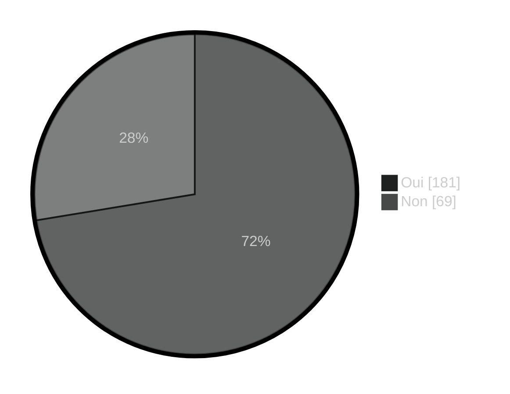
```mermaid
---
config:
  pie:
    textPosition: 0.5
  themeVariables:
    pieOuterStrokeWidth: 5px
  theme: neo-dark
---
pie showData
    "Oui" : 181
    "Non" : 69

```
***
## Estimez-vous que votre hiérarchie (autre que votre responsable hiérarchique direct) assume ses responsabilités

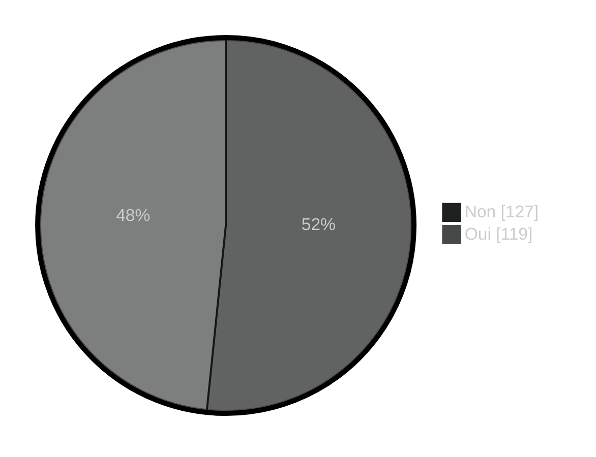
```mermaid
---
config:
  pie:
    textPosition: 0.5
  themeVariables:
    pieOuterStrokeWidth: 5px
  theme: neo-dark
---
pie showData
    "Non" : 127
    "Oui" : 119

```

***
## Est-ce qu'il s'agit de

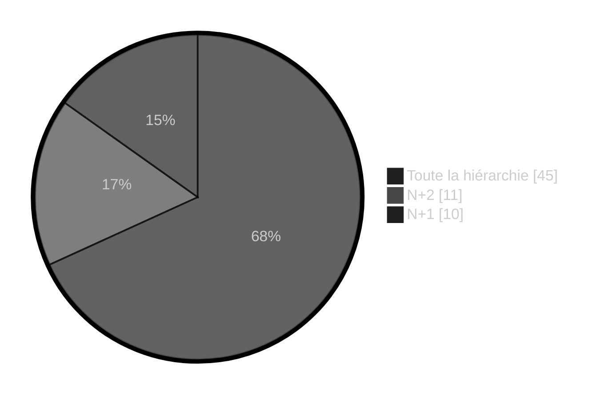
```mermaid
---
config:
  pie:
    textPosition: 0.5
  themeVariables:
    pieOuterStrokeWidth: 5px
  theme: neo-dark
---
pie showData
    "Toute la hiérarchie" : 45
    "N+2" : 11
    "N+1" : 10

```
***
## Êtes-vous en conflit ou en désaccord avec votre supérieur hiérarchique direct

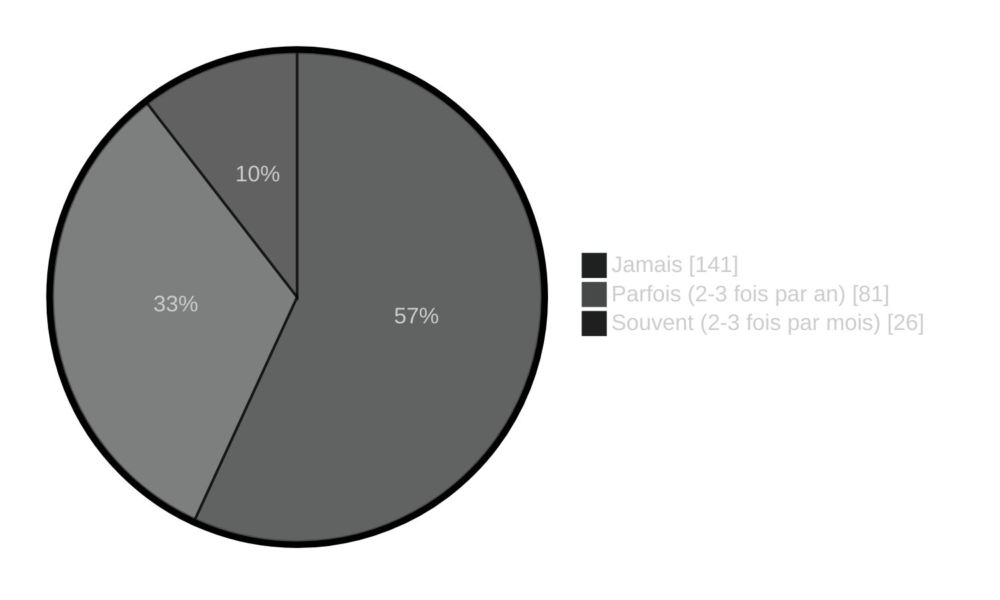
```mermaid
---
config:
  pie:
    textPosition: 0.5
  themeVariables:
    pieOuterStrokeWidth: 5px
  theme: neo-dark
---
pie showData
    "Jamais" : 141
    "Parfois (2-3 fois par an)" : 81
    "Souvent (2-3 fois par mois)" : 26

```
***
## Êtes-vous en conflit avec vos responsables hiérarchiques (autre que le responsable hiérarchique direct)
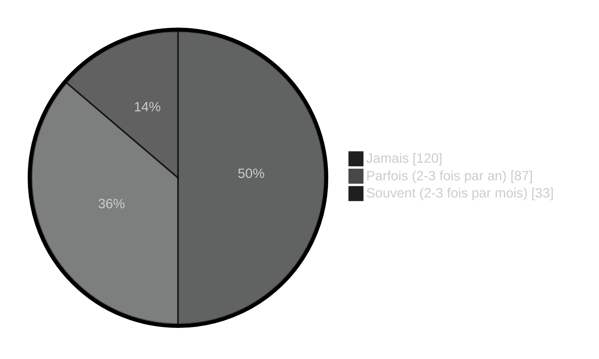
```mermaid
---
config:
  pie:
    textPosition: 0.5
  themeVariables:
    pieOuterStrokeWidth: 5px
  theme: neo-dark
---
pie showData
    "Jamais" : 120
    "Parfois (2-3 fois par an)" : 87
    "Souvent (2-3 fois par mois)" : 33


```
***
## Êtes-vous en conflit avec vos collaborateurs
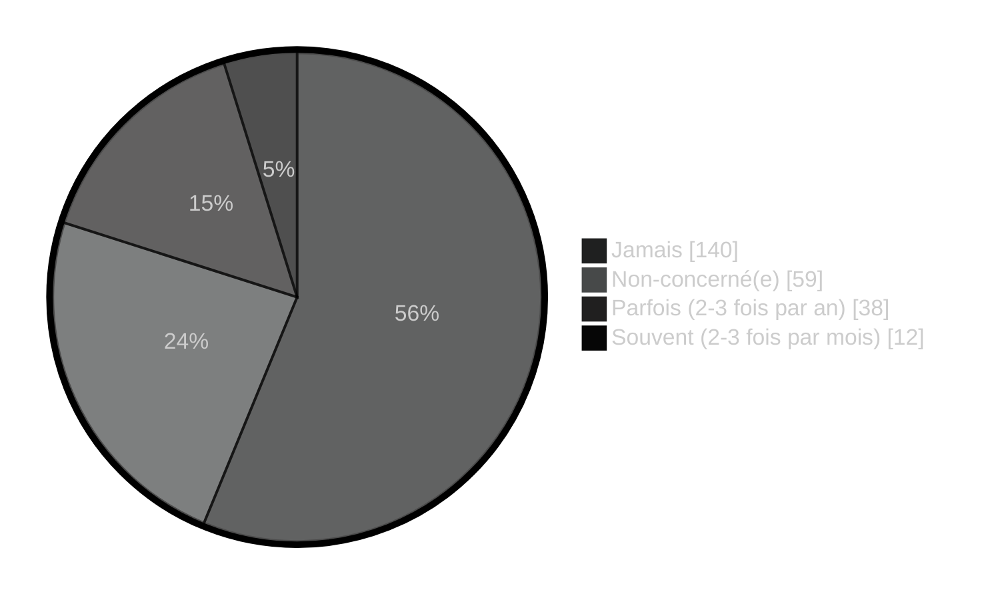
```mermaid
---
config:
  pie:
    textPosition: 0.5
  themeVariables:
    pieOuterStrokeWidth: 5px
  theme: neo-dark
---
pie showData
    "Jamais" : 140
    "Non-concerné(e)" : 59
    "Parfois (2-3 fois par an)" : 38
    "Souvent (2-3 fois par mois)" : 12

```
***
## Êtes-vous en conflit avec vos collègues
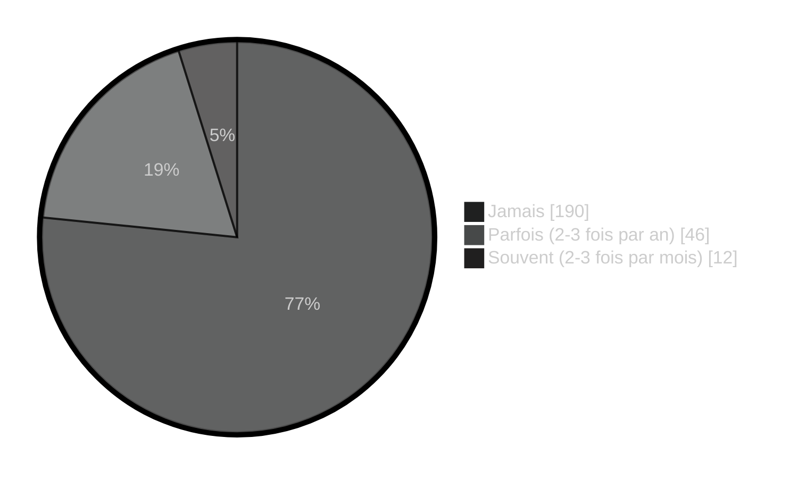
```mermaid
---
config:
  pie:
    textPosition: 0.5
  themeVariables:
    pieOuterStrokeWidth: 5px
  theme: neo-dark
---
pie showData
    "Jamais" : 190
    "Parfois (2-3 fois par an)" : 46
    "Souvent (2-3 fois par mois)" : 12


```
***
## Exercez-vous une partie de votre activité en télétravail ?
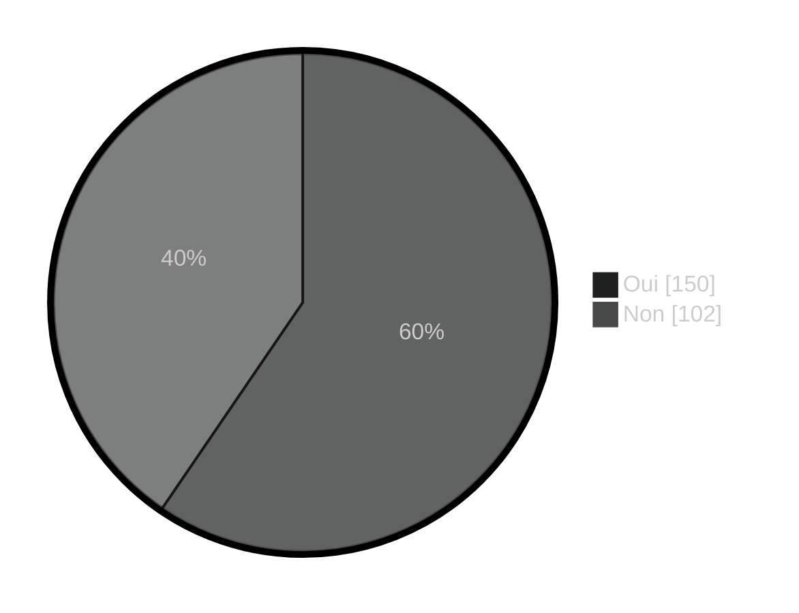
```mermaid
---
config:
  pie:
    textPosition: 0.5
  themeVariables:
    pieOuterStrokeWidth: 5px
  theme: neo-dark
---
pie showData
    "Oui" : 150
    "Non" : 102


```
***
## Si non, vous n'avez pas de télétravail car
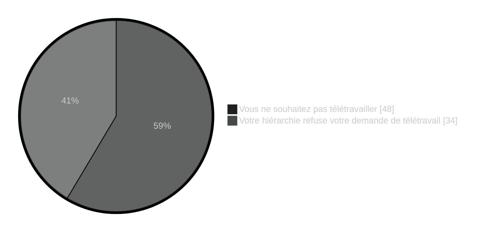
```mermaid
---
config:
  pie:
    textPosition: 0.5
  themeVariables:
    pieOuterStrokeWidth: 5px
  theme: neo-dark
---
pie showData
    "Vous ne souhaitez pas télétravailler" : 48
    "Votre hiérarchie refuse votre demande de télétravail" : 34


```
***
## En moyenne, combien de jours télétravaillez-vous par semaine ?
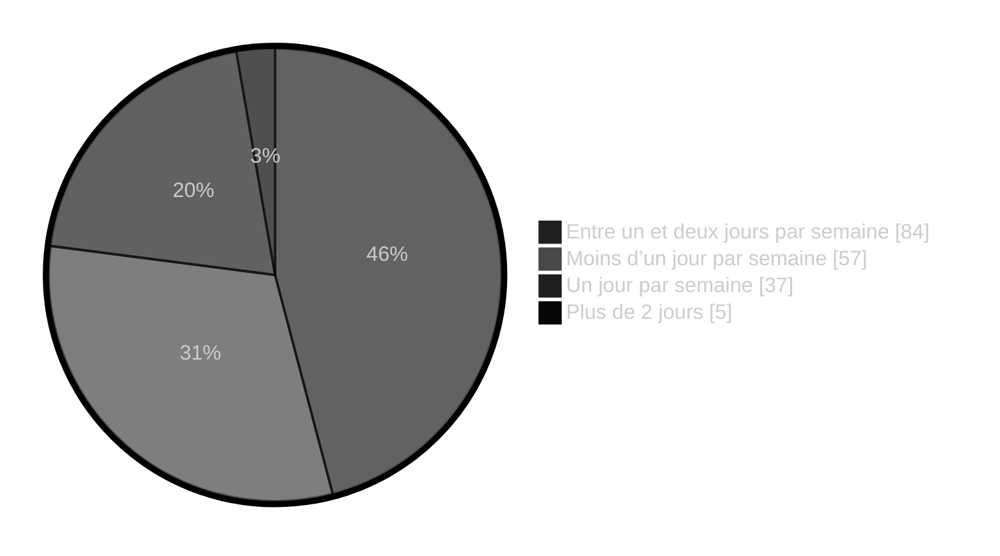
```mermaid
---
config:
  pie:
    textPosition: 0.5
  themeVariables:
    pieOuterStrokeWidth: 5px
  theme: neo-dark
---
pie showData
    "Entre un et deux jours par semaine" : 84
    "Moins d’un jour par semaine" : 57
    "Un jour par semaine" : 37
    "Plus de 2 jours" : 5

```
***
## Est-ce que l'on vous a imposé le nombre de jours en télétravail ?
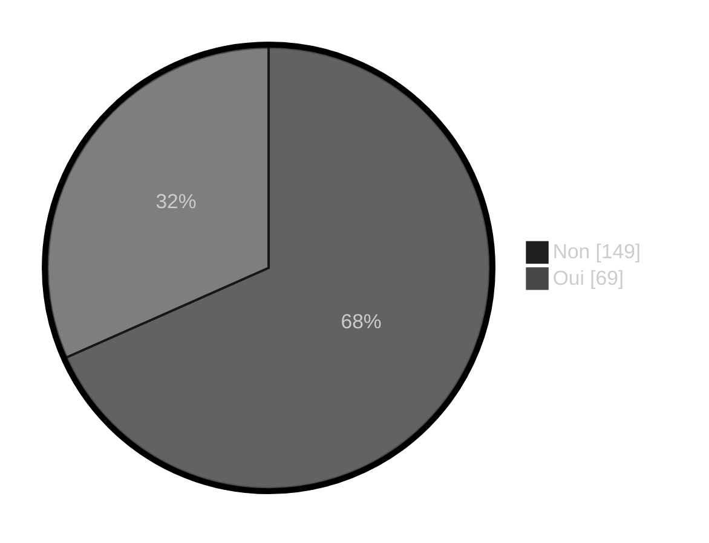
```mermaid
---
config:
  pie:
    textPosition: 0.5
  themeVariables:
    pieOuterStrokeWidth: 5px
  theme: neo-dark
---
pie showData
    "Non" : 149
    "Oui" : 69


```
***
## Souhaiteriez-vous télétravailler davantage ?
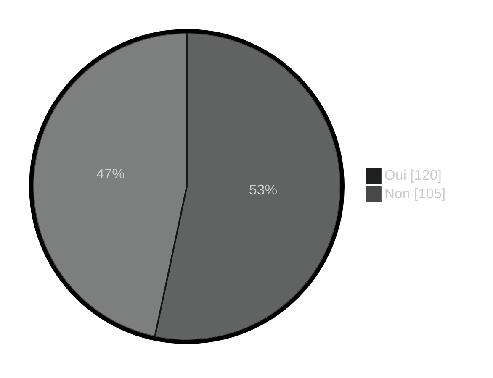
```mermaid
---
config:
  pie:
    textPosition: 0.5
  themeVariables:
    pieOuterStrokeWidth: 5px
  theme: neo-dark
---
pie showData
    "Oui" : 120
    "Non" : 105

```
***
## Depuis combien de temps occupez-vous votre poste actuel ?
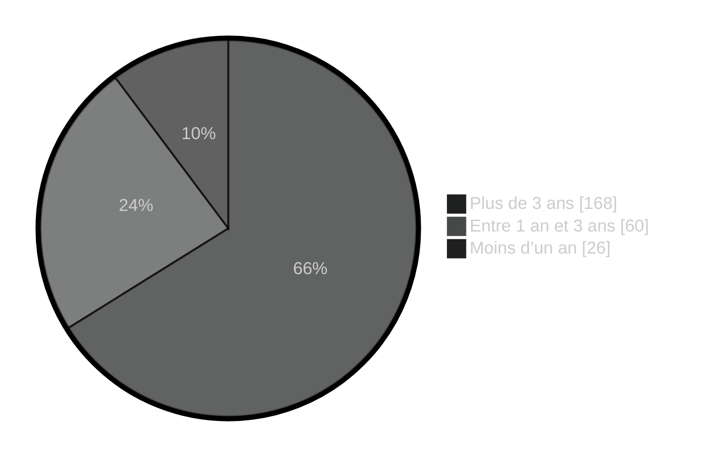
```mermaid
---
config:
  pie:
    textPosition: 0.5
  themeVariables:
    pieOuterStrokeWidth: 5px
  theme: neo-dark
---
pie showData
    "Plus de 3 ans" : 168
    "Entre 1 an et 3 ans" : 60
    "Moins d’un an" : 26

```
***
## Avez-vous une fiche de poste
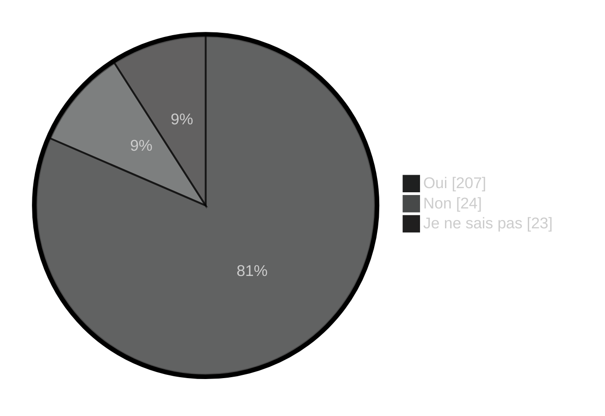
```mermaid
---
config:
  pie:
    textPosition: 0.5
  themeVariables:
    pieOuterStrokeWidth: 5px
  theme: neo-dark
---
pie showData
    "Oui" : 207
    "Non" : 24
    "Je ne sais pas" : 23

```
***
## Si oui, votre fiche de poste correspond-elle à vos missions ?
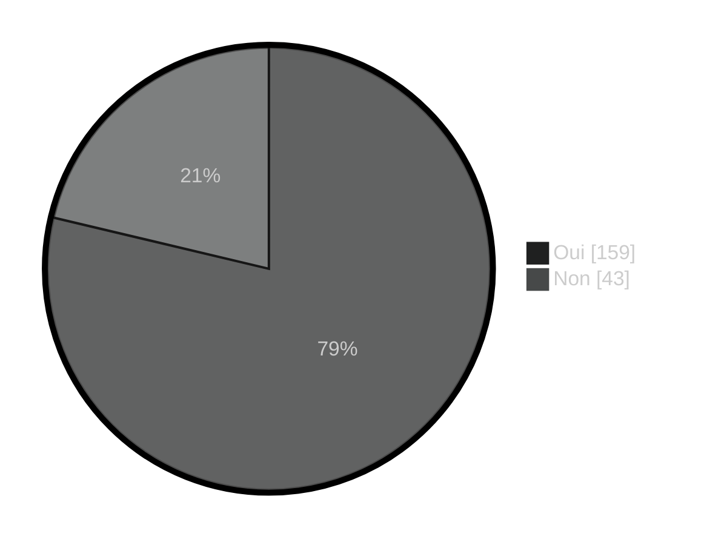
```mermaid
---
config:
  pie:
    textPosition: 0.5
  themeVariables:
    pieOuterStrokeWidth: 5px
  theme: neo-dark
---
pie showData
    "Oui" : 159
    "Non" : 43

```
***
## Votre poste correspond-il à vos compétences ?
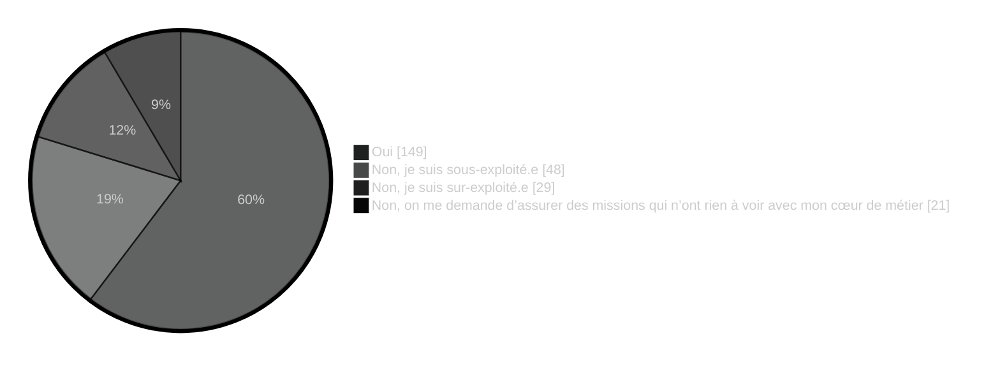
```mermaid
---
config:
  pie:
    textPosition: 0.5
  themeVariables:
    pieOuterStrokeWidth: 5px
  theme: neo-dark
---
pie showData
    "Oui" : 149
    "Non, je suis sous-exploité.e" : 48
    "Non, je suis sur-exploité.e" : 29
    "Non, on me demande d’assurer des missions qui n’ont rien à voir avec mon cœur de métier" : 21

```
***
## Souhaiteriez-vous voir évoluer vos missions ?
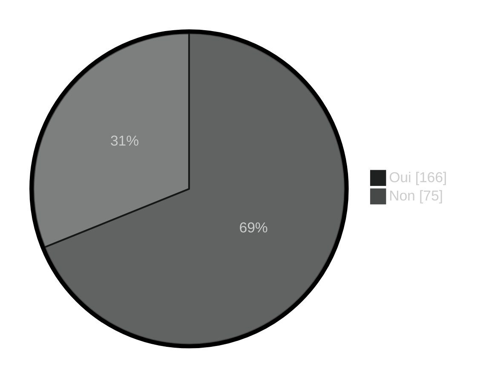
```mermaid
---
config:
  pie:
    textPosition: 0.5
  themeVariables:
    pieOuterStrokeWidth: 5px
  theme: neo-dark
---
pie showData
    "Oui" : 166
    "Non" : 75

```
***
## Avez-vous envisagé de changer de poste à cause de vos conditions de travail ?
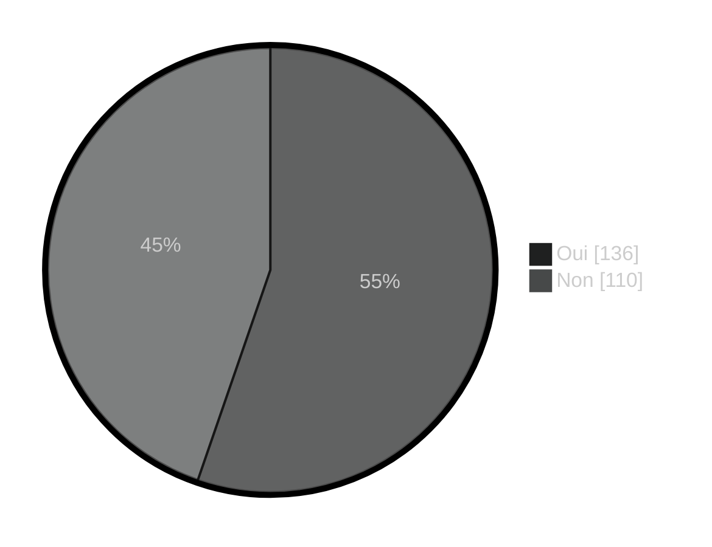
```mermaid
---
config:
  pie:
    textPosition: 0.5
  themeVariables:
    pieOuterStrokeWidth: 5px
  theme: neo-dark
---
pie showData
    "Oui" : 136
    "Non" : 110

```
***
## Dans votre service, UFR, ou direction y a-t-il des collègues qui ont quitté (le service, l’UFR, la direction) pour des raisons liées aux conditions de travail ?
```mermaid
---
config:
  pie:
    textPosition: 0.5
  themeVariables:
    pieOuterStrokeWidth: 5px
  theme: neo-dark
---
pie showData
    "Oui" : 189
    "Non" : 55

```
***
## Avez-vous eu un entretien professionnel avec votre hiérarchie ces deux dernières années ?
```mermaid
---
config:
  pie:
    textPosition: 0.5
  themeVariables:
    pieOuterStrokeWidth: 5px
  theme: neo-dark
---
pie showData
    "Oui" : 170
    "Non" : 79

```
***
## Si oui, étiez-vous en accord avec le contenu final de votre entretien professionnel ?
```mermaid
---
config:
  pie:
    textPosition: 0.5
  themeVariables:
    pieOuterStrokeWidth: 5px
  theme: neo-dark
---
pie showData
    "Oui" : 140
    "Non" : 54

```
***
## Vos conditions de travail ont-elles engendré des conséquences sur votre état de santé (traitement médical, arrêt maladie) ?
```mermaid
---
config:
  pie:
    textPosition: 0.5
  themeVariables:
    pieOuterStrokeWidth: 5px
  theme: neo-dark
---
pie showData
    "Non" : 152
    "Oui" : 102

```
***
## Avez-vous déjà consulté le médecin de prévention de l’UVSQ concernant la dégradation de votre état de santé en lien avec vos conditions de travail ?
```mermaid
---
config:
  pie:
    textPosition: 0.5
  themeVariables:
    pieOuterStrokeWidth: 5px
  theme: neo-dark
---
pie showData
    "Non" : 197
    "Oui" : 54

```
***
## Si oui, est-ce que la situation s'est améliorée au sujet de vos conditions de travail ?
```mermaid
---
config:
  pie:
    textPosition: 0.5
  themeVariables:
    pieOuterStrokeWidth: 5px
  theme: neo-dark
---
pie showData
    "Non" : 38
    "Oui" : 15

```
***
## Avez-vous vécu ou été témoin de situations qui selon vous pourraient être qualifiées de harcèlement (moral, sexuel…)
```mermaid
---
config:
  pie:
    textPosition: 0.5
  themeVariables:
    pieOuterStrokeWidth: 5px
  theme: neo-dark
---
pie showData
    "Non" : 129
    "Oui" : 119

```
***
## Êtes-vous :
```mermaid
---
config:
  pie:
    textPosition: 0.5
  themeVariables:
    pieOuterStrokeWidth: 5px
  theme: neo-dark
---
pie showData
    "Une femme" : 170
    "Un homme" : 82

```
***
## Votre catégorie (en tant que titulaire ou contractuel) ?
```mermaid
---
config:
  pie:
    textPosition: 0.5
  themeVariables:
    pieOuterStrokeWidth: 5px
  theme: neo-dark
---
pie showData
    "A" : 101
    "B" : 101
    "C" : 48

```
***
## Encadrez-vous une équipe ?
```mermaid
---
config:
  pie:
    textPosition: 0.5
  themeVariables:
    pieOuterStrokeWidth: 5px
  theme: neo-dark
---
pie showData
    "Non" : 179
    "Oui" : 74

```
***
## Trouvez-vous encore du sens à votre travail ?
```mermaid
---
config:
  pie:
    textPosition: 0.5
  themeVariables:
    pieOuterStrokeWidth: 5px
  theme: neo-dark
---
pie showData
    "Oui" : 171
    "Non" : 78

```
***

# Quels sont vos principaux motifs d’insatisfaction

![Motifs d'insatisfaction](https://quickchart.io/chart?c=%7B%22type%22%3A%22horizontalBar%22%2C%22data%22%3A%7B%22labels%22%3A%5B%22Effectifs%20insuffisants%22%2C%22Manque%20de%20reconnaissance%22%2C%22Manque%20de%20consid%C3%A9ration%22%2C%22Manque%20d%E2%80%99informations%20descendantes%22%2C%22Lourdeur%20des%20proc%C3%A9dures%22%2C%22Charge%20de%20travail%20trop%20importante%22%2C%22Mauvaise%20ambiance%22%2C%22Formations%20insuffisantes%22%2C%22Pression%20de%20la%20hi%C3%A9rarchie%22%2C%22Rythme%20de%20travail%20%C3%A9lev%C3%A9%22%2C%22Mauvaises%20conditions%20mat%C3%A9rielles%22%2C%22Manque%20d%E2%80%99informations%20ascendantes%22%2C%22Outils%20trop%20complexes%22%5D%2C%22datasets%22%3A%5B%7B%22label%22%3A%22Nombre%20de%20r%C3%A9ponses%22%2C%22data%22%3A%5B131%2C130%2C121%2C118%2C97%2C71%2C65%2C64%2C64%2C48%2C43%2C28%2C25%5D%2C%22backgroundColor%22%3A%22%23669%22%7D%5D%7D%2C%22options%22%3A%7B%22legend%22%3A%7B%22display%22%3Afalse%7D%2C%22title%22%3A%7B%22display%22%3Afalse%7D%2C%22scales%22%3A%7B%22xAxes%22%3A%5B%7B%22ticks%22%3A%7B%22beginAtZero%22%3Atrue%7D%7D%5D%7D%2C%22plugins%22%3A%7B%22datalabels%22%3A%7B%22anchor%22%3A%22end%22%2C%22align%22%3A%22right%22%2C%22color%22%3A%22black%22%2C%22font%22%3A%7B%22weight%22%3A%22bold%22%7D%7D%7D%7D%2C%22plugins%22%3A%5B%22datalabels%22%5D%7D)

***
## Considérez-vous suffisantes vos conditions matérielles

![Conditions matérielles](https://quickchart.io/chart?width=1000&height=500&c=%7B%22type%22%3A%22bar%22%2C%22data%22%3A%7B%22labels%22%3A%5B%22Espace%20de%20travail%22%2C%22Mat%C3%A9riel%20informatique%22%2C%22Mobilier%22%2C%22Restauration%22%2C%22Ambiance%20sonore%20et%20visuelle%22%5D%2C%22datasets%22%3A%5B%7B%22label%22%3A%22Suffisant%22%2C%22data%22%3A%5B219%2C%20197%2C%20196%2C%20117%2C%20162%5D%2C%22backgroundColor%22%3A%22%234CAF50%22%2C%22datalabels%22%3A%7B%22color%22%3A%22white%22%2C%20%22anchor%22%3A%22center%22%2C%20%22align%22%3A%22center%22%2C%20%22font%22%3A%7B%22size%22%3A12%2C%20%22weight%22%3A%22bold%22%7D%7D%7D%2C%20%7B%22label%22%3A%22Insuffisant%22%2C%20%22data%22%3A%5B33%2C%2055%2C%2052%2C%20131%2C%2087%5D%2C%20%22backgroundColor%22%3A%22%23F44336%22%2C%20%22datalabels%22%3A%7B%22color%22%3A%22white%22%2C%20%22anchor%22%3A%22center%22%2C%20%22align%22%3A%22center%22%2C%20%22font%22%3A%7B%22size%22%3A12%2C%20%22weight%22%3A%22bold%22%7D%7D%7D%5D%7D%2C%20%22options%22%3A%7B%22indexAxis%22%3A%22y%22%2C%20%22layout%22%3A%7B%22padding%22%3A%7B%22left%22%3A150%7D%7D%2C%20%22plugins%22%3A%7B%22legend%22%3A%7B%22position%22%3A%22right%22%7D%7D%2C%20%22scales%22%3A%7B%22x%22%3A%7B%22beginAtZero%22%3Atrue%7D%7D%7D%7D)

